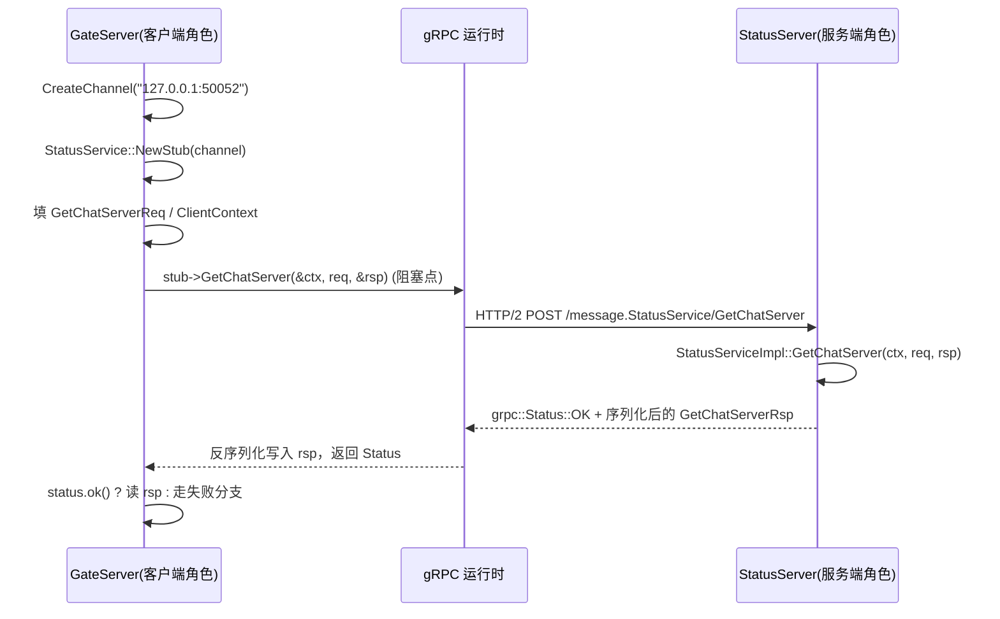
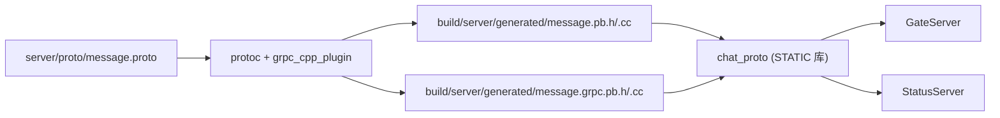
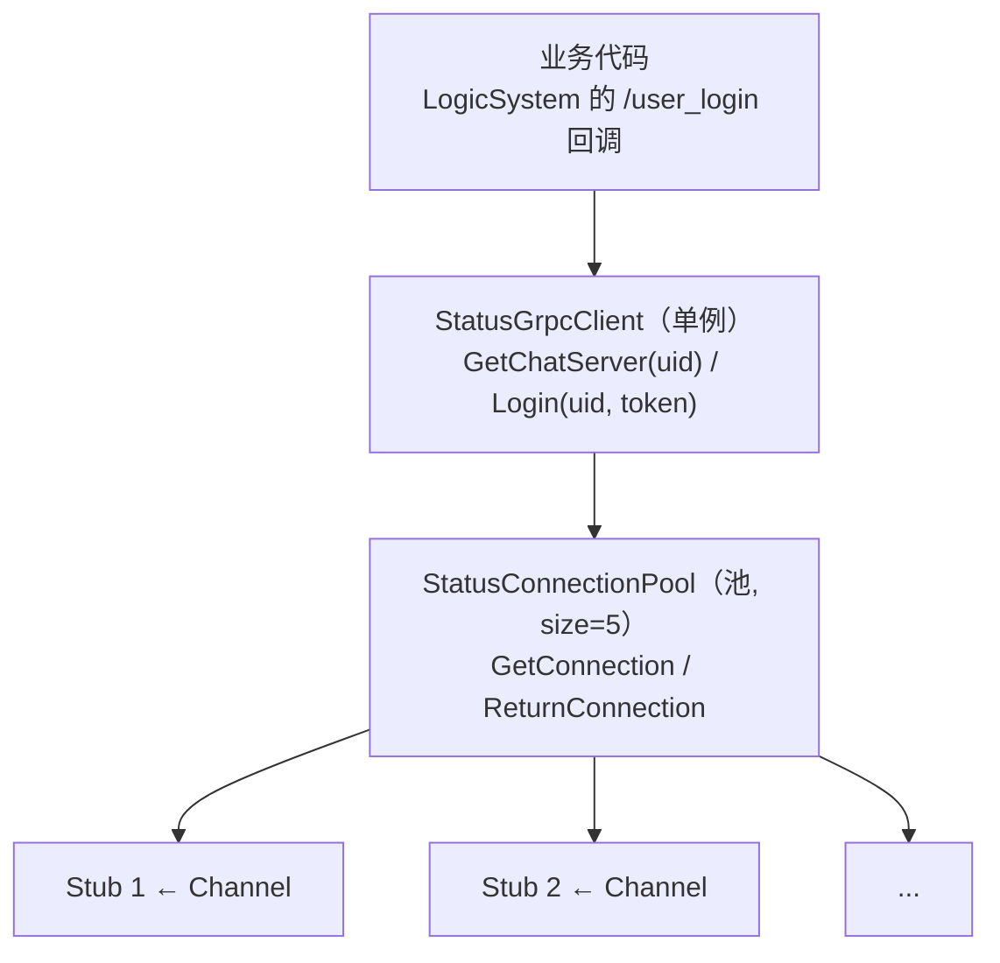
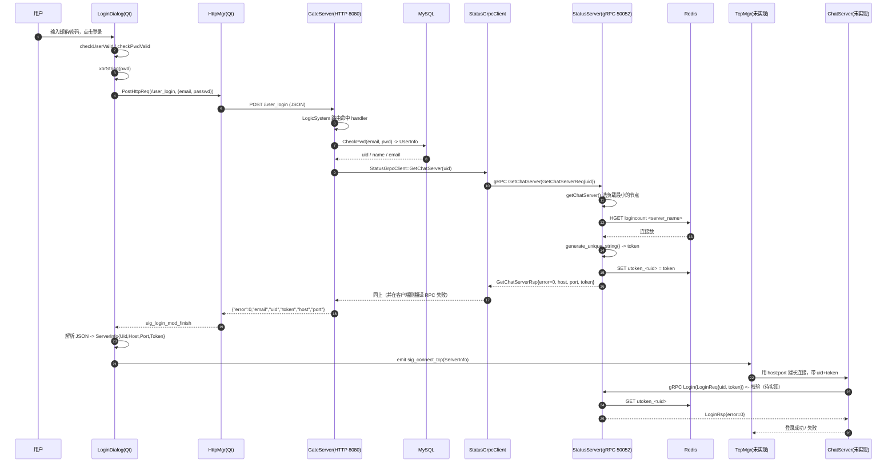
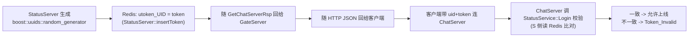
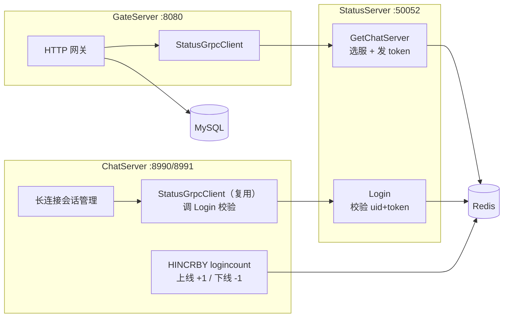
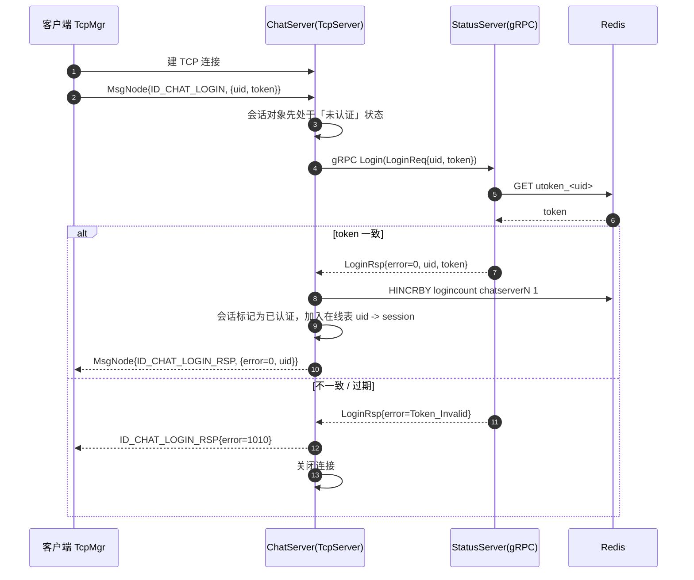

# gRPC 使用指南与流程

> 版本：2026-09-23
> 对应代码：`server/proto/message.proto`、`server/StatusServer/*`、`server/GateServer/StatusGrpcClient.*`、`server/VerifyServer/*`、`client/logindialog.cpp`
> 重点链路：**GateServer ↔ StatusServer（登录选服 + 发放 token）**
> 读者假设：已经写过 Boost.Asio / Beast 的异步 HTTP 服务，对「同步 RPC 调用」「连接池」有基本概念，但没系统整理过 gRPC。

---

## 阅读地图

| 章节 | 内容 | 什么时候翻它 |
| --- | --- | --- |
| 1 | 一页速览：gRPC 在本项目的三个出现点 | 想快速定位「哪段代码在调谁」 |
| 2-4 | gRPC 是什么、核心概念、proto3 语法 | 面试前复习、写新接口前 |
| 5 | CMake 生成 `chat_proto` 的完整链路 | 加/改 `.proto` 之后 |
| 6-7 | 服务端与客户端的最小写法（对照 StatusServer / StatusGrpcClient） | 新写一个 gRPC 服务 |
| 8 | **完整流程：点击登录 → 拿到 ChatServer 与 token** | 理解业务主线 |
| 9 | 选服（负载最小）逻辑逐行解析 | 调试「为什么连到了 chatserver1」 |
| 10 | **当前实现的隐患清单与修复代码** | 准备改这块代码时 |
| 11 | ChatServer 设计草案（未实现） | 下一步动手前 |
| 12-14 | 排错手册、面试速记、API/术语附录 | 出问题时、面试前 |

---

## 1. 一页速览

gRPC 在本项目里一共出现三处，其中两处已实现，一处待实现：

| 链路 | RPC 接口 | 服务端（谁提供） | 客户端（谁调用） | 地址 | 状态 |
| --- | --- | --- | --- | --- | --- |
| 验证码 | `VerifyService.GetVerifyCode` | `VerifyServer`（Node.js / `@grpc/grpc-js`） | `GateServer::VerifyGrpcClient` | `127.0.0.1:50051` | 已实现 |
| **登录选服** | `StatusService.GetChatServer` | `StatusServer::StatusServiceImpl` | `GateServer::StatusGrpcClient` | `127.0.0.1:50052` | 已实现 |
| **登录校验** | `StatusService.Login` | 同上 | 目前**没有调用方**（预留给 ChatServer） | `127.0.0.1:50052` | 已实现但未接入 |
| 聊天会话 | 待定义 | ChatServer（未实现） | 客户端 Qt `TcpMgr` | `127.0.0.1:8990 / 8991` | 未实现 |

端口与角色一览：

| 进程 | 角色 | 端口 | 协议 | 语言 |
| --- | --- | --- | --- | --- |
| 客户端 | UI + 长连接 | - | HTTP / 自定义 TCP | Qt C++ |
| GateServer | HTTP 网关（唯一对客户端暴露） | 8080 | HTTP | C++ / Beast |
| VerifyServer | 邮件验证码 | 50051 | gRPC | Node.js |
| StatusServer | 状态与调度（选服、token） | 50052 | gRPC | C++ |
| ChatServer x2 | 聊天长连接（未实现） | 8990 / 8991 | 自定义 TCP | C++ |

一句话概括这次新增的东西：**客户端不再需要知道有哪些 ChatServer，登录时由 GateServer 通过 gRPC 问 StatusServer「给我一个负载最小的 ChatServer 地址 + 一把一次性钥匙（token）」，客户端拿着 host/port/token 自己去连 ChatServer。**

---

## 2. gRPC 是什么，为什么这里用它

gRPC = **IDL（`.proto`）+ 代码生成 + HTTP/2 传输 + Protobuf 序列化**。

你只写两样东西：

1. 接口定义（`service` + `message`）；
2. 服务端实现（继承生成的 `Service` 基类）。

剩下的 stub、序列化、连接管理、多路复用全部由 protoc + gRPC 运行时生成。

### 2.1 和另外两种做法的对比

| 维度 | 自定义 TCP + 手写协议 | REST/HTTP + JSON | gRPC |
| --- | --- | --- | --- |
| 接口契约 | 靠文档和约定 | OpenAPI/文档（弱约束） | `.proto` 强约束，改错字段编译期就报错 |
| 序列化 | 手写 | JSON（文本、体积大） | Protobuf（二进制、体积小、解析快） |
| 传输 | 裸 TCP | HTTP/1.1 | HTTP/2（多路复用、单连接并发多请求） |
| 流式 | 自己实现 | 需要 SSE/WebSocket | 原生四种 RPC 类型 |
| 跨语言 | 每端重写 | 天然跨语言 | 天然跨语言（本项目就是 C++ ↔ Node.js） |
| 代价 | - | - | 需要 protoc/工具链，二进制调试不如 JSON 直观 |

本项目里 `GateServer`↔`StatusServer`、`GateServer`↔`VerifyServer` 都是**内网服务间调用**：不需要浏览器直接访问、不需要人肉看报文、但需要强契约 + 高性能。这正是 gRPC 的甜点区。

而**客户端 ↔ GateServer 走 HTTP/JSON**、**客户端 ↔ ChatServer 走自定义 TCP**，因为前者要方便对接（curl 就能测），后者要自己控制心跳与推送。

### 2.2 四种 RPC 类型（本项目只用第一种）

| 类型 | 声明 | 语义 | 本项目 |
| --- | --- | --- | --- |
| 一元 Unary | `rpc F(Req) returns (Rsp)` | 一请求一响应 | 全部使用 |
| 服务端流 | `rpc F(Req) returns (stream Rsp)` | 一请求多响应 | 未用（可做推送/日志） |
| 客户端流 | `rpc F(stream Req) returns (Rsp)` | 多请求一响应 | 未用（可做文件上传） |
| 双向流 | `rpc F(stream Req) returns (stream Rsp)` | 全双工 | 未用（可做聊天，但本项目聊天走裸 TCP） |

> 面试点：为什么不拿 gRPC 双向流直接做聊天？答案是「可以，但本项目选择把聊天长连接握在自己手里」，因为要做自定义心跳、离线消息、踢人、以及后续可能接入的语音/视频信令，裸 TCP 更好控。这个取舍要能说清楚。

---

## 3. 六个核心概念（够用版）

### 3.1 客户端侧

| 概念 | 类型 | 作用 | 本项目对应 |
| --- | --- | --- | --- |
| `Channel` | `grpc::Channel` | 与某个 `host:port` 的连接抽象，**重量级、应复用**、线程安全 | `StatusConnectionPool` 构造时 `CreateChannel` |
| `Stub` | `StatusService::Stub` | 由 Channel 生成的方法代理，调用 stub 上的方法就等于发 RPC | `_connections` 队列里的元素 |
| `ClientContext` | `grpc::ClientContext` | 单次调用的上下文：deadline、metadata（token）、取消、压缩等 | `StatusGrpcClient::GetChatServer` 里的 `ClientContext context;` |
| `Status` | `grpc::Status` | **传输层**结果：`ok()`、`error_code()`、`error_message()` | `if (status.ok())` |

### 3.2 服务端侧

| 概念 | 类型 | 作用 | 本项目对应 |
| --- | --- | --- | --- |
| `ServerBuilder` | `grpc::ServerBuilder` | 组装监听端口、凭据、注册服务 | `StatusServer.cpp::RunServer()` |
| `Service` | `StatusService::Service` | protoc 生成的抽象基类，必须继承并 override | `class StatusServiceImpl final : public StatusService::Service` |
| `ServerContext` | `grpc::ServerContext` | 单次请求的服务端上下文：metadata、peer、deadline | `GetChatServer(ServerContext* context, ...)` |
| `Server` | `grpc::Server` | `BuildAndStart()` 的产物，负责 `Wait()` / `Shutdown()` | `std::unique_ptr<grpc::Server> server` |

### 3.3 一次调用的骨架（把这 6 个概念串起来）



**唯一的阻塞点在 `stub->Method(...)` 这一行**：同步 API 下它会阻塞当前线程直到响应或超时。这一点在第 10 章会变成一个真实隐患。

---

## 4. proto3 语法与本项目对照

### 4.1 当前的 `server/proto/message.proto`

```proto
syntax = "proto3";

package message; // 命名空间，防止冲突

// 定义一个gRPC服务
service VerifyService {
    rpc GetVerifyCode (GetVerifyReq) returns (GetVerifyRsp) {}
}

message GetVerifyReq { string email = 1; }
message GetVerifyRsp { int32 error = 1; string email = 2; string code = 3; }

message GetChatServerReq { int32 uid = 1; }
message GetChatServerRsp {
    int32  error = 1;
    string host  = 2;
    string port  = 3;
    string token = 4;
}

message LoginReq { int32 uid = 1; string token = 2; }
message LoginRsp { int32 error = 1; int32 uid = 2; string token = 3; }

service StatusService {
    rpc GetChatServer (GetChatServerReq) returns (GetChatServerRsp) {}
    rpc Login (LoginReq) returns (LoginRsp) {}
}
```

一个文件里同时放了两个 `service`，这是**允许且常用**的。C++ 侧生成 `message.pb.h`（消息 + 两个 Service 基类）和 `message.grpc.pb.h`（两个 Stub）。

### 4.2 逐项语法要点

| 语法 | 含义 | 本项目注意点 |
| --- | --- | --- |
| `syntax = "proto3"` | 必写。proto3 下字段默认值不参与序列化 | 所以 `error = 0` 这种「成功」在线上是**不占字节**的，反序列化后默认就是 0，正好符合约定 |
| `package message;` | 生成 C++ 命名空间 `message::` | 所有类名前都带 `using message::Xxx;` |
| `service` | 定义一个 RPC 服务 | 名字决定生成的 `Stub` / `Service` 类名 |
| `rpc F(Req) returns (Rsp)` | 一元调用 | `{}` 是空实现体，**proto 里不能写业务逻辑** |
| `= 1` / `= 2` | **字段编号**，不是默认值 | 这是序列化后的标签，一旦上线**绝不能改**，只能新增 |
| `int32 uid` | 类型 | 见下方类型映射表 |

### 4.3 类型映射（proto → C++），只列用得到的

| proto | C++ | 说明 |
| --- | --- | --- |
| `int32` / `int64` | `int32_t` / `int64_t` | 建议 uid 用 `int64` 或 `uint64`，见第 10 章 |
| `string` | `std::string` | 生成 `host()`/`set_host()` |
| `bool` | `bool` | - |
| `bytes` | `std::string` | 二进制安全 |
| `repeated T` | `RepeatedField<T>` | 类似 vector |
| `map<K,V>` | `Map<K,V>` | - |
| `enum` | 生成带 `_IsValid` 的枚举 | 本项目错误码用的是 C++ 侧手写枚举，**没有**放进 proto（第 10 章会讨论这个取舍） |

### 4.4 生成类的命名规律（背下来能省很多查文档的时间）

以 `message GetChatServerRsp { int32 error = 1; string host = 2; }` 为例：

| 你想做的事 | 生成的 C++ |
| --- | --- |
| 类型名 | `message::GetChatServerRsp` |
| 构造 | `GetChatServerRsp rsp;` |
| 读字段 | `rsp.error()`、`rsp.host()` |
| 写字段 | `rsp.set_error(0)`、`rsp.set_host("127.0.0.1")` |
| 是否被显式赋值 | `rsp.has_xxx()`（proto3 下仅 `optional` 字段和 message 字段有 `has_`） |
| 序列化成字符串 | `rsp.SerializeAsString()` |
| 从字符串解析 | `rsp.ParseFromString(s)` |
| Stub 方法 | `stub->GetChatServer(&ctx, req, &rsp)` |
| 服务端虚函数 | `Status GetChatServer(ServerContext*, const GetChatServerReq*, GetChatServerRsp*) override` |

> 服务的**类名 = 生成的 Service/Stub 前缀**，方法名 **大小写原样保留**。所以 proto 里写 `GetChatServer`，C++ 里就是 `stub->GetChatServer(...)`，别写成 `get_chat_server`。

### 4.5 proto3 兼容性三条铁律

1. **字段编号只增不改、不重复、不复用已删除编号**（要删除字段，就把编号 `reserved` 掉）。
2. 不要改字段类型（`int32` → `string` 是高危变更）。
3. 不要重命名 `service` / `message`，那等于改名换姓，双方必须同时重新生成。

只增字段的话，新旧版本可以共存：老客户端读到新字段会当作未知字段忽略。

---

## 5. 工程落地：从 `.proto` 到可执行文件

### 5.1 生成链路总览



### 5.2 `server/CMakeLists.txt` 里真正关键的四步

```cmake
# 1) 生成 .pb.cc / .grpc.pb.cc
add_custom_command(
    OUTPUT ${GENERATED_SRCS} ${GENERATED_HDRS}
    COMMAND ${Protobuf_PROTOC_EXECUTABLE}
        "--proto_path=${PROTO_DIR}"
        "--cpp_out=${GENERATED_DIR}"
        "--grpc_out=${GENERATED_DIR}"
        "--plugin=protoc-gen-grpc=$<TARGET_FILE:gRPC::grpc_cpp_plugin>"
        ${PROTO_FILES}
    DEPENDS ${PROTO_FILES} gRPC::grpc_cpp_plugin
    COMMENT "Running protoc with gRPC plugin"
    VERBATIM
)

# 2) 编译成静态库（注意是 add_library，不是 add_custom_target）
add_library(chat_proto STATIC ${GENERATED_SRCS})

# 3) 头文件目录对下游公开
target_include_directories(chat_proto PUBLIC ${GENERATED_DIR})

# 4) 依赖公开传递
target_link_libraries(chat_proto PUBLIC
    gRPC::grpc++
    protobuf::libprotobuf
)
```

下游只要一行就够：

```cmake
target_link_libraries(StatusServer PRIVATE chat_proto)
```

`PUBLIC` 会把 `gRPC::grpc++`、`protobuf::libprotobuf` 和 `${GENERATED_DIR}` 一起传递过去，所以 GateServer/StatusServer 不需要再各自 find_package 一次 gRPC。

### 5.3 protoc 到底生成了什么

| 生成物 | 内容 | 谁用 |
| --- | --- | --- |
| `message.pb.h/.cc` | 所有 `message` 类、序列化代码、**`VerifyService::Service` / `StatusService::Service` 基类** | 客户端和服务端（都要） |
| `message.grpc.pb.h/.cc` | **`VerifyService::Stub` / `StatusService::Stub`**、Channel 绑定、客户端调用胶水 | 主要给客户端 |

> 面试点：为什么要有 `grpc_cpp_plugin`？因为 protoc 本身只懂「消息」；`--grpc_out` 和 plugin 才负责把 `service` 变成 Stub/Service 代码。

### 5.4 Node.js 侧为什么不用生成代码

`VerifyServer/proto.js` 走的是运行时加载：

```js
const packageDefinition = protoLoader.loadSync(PROTO_PATH, {
    keepCase: true, longs: String, enums: String, defaults: true, oneofs: true
})
const message_proto = grpc.loadPackageDefinition(packageDefinition).message
```

`@grpc/proto-loader` 在进程启动时解析同一个 `.proto`，因此**改 proto 不需要重新生成也不需重新编译 Node 服务，但要重启它**。这也意味着：**C++ 侧和 Node.js 侧必须引用同一个 `message.proto`**——目前两边都是 `server/proto/message.proto`（`path.join(__dirname, '../proto/message.proto')`），这个约定别破坏。

### 5.5 踩坑提醒（详见《踩坑复盘-gRPC_vcpkg_VS2022.md》）

| 症状 | 原因 | 处理 |
| --- | --- | --- |
| LNK2019 缺 `message::VerifyService::Stub` 等符号 | plugin 路径没解析出来 → `message.grpc.pb.cc` 没生成 | 用 `$<TARGET_FILE:gRPC::grpc_cpp_plugin>` 生成器表达式 |
| 构建成功但 F5 报 LNK2019 | 用 `.sln` 模式打开了 CMake 项目，没有 `chat_proto` 依赖 | 用「文件 → 打开 → 文件夹」 |
| 改了 `.proto` 但行为没变 | CMake 没重新跑 protoc | 重新生成（或清理 `build/server/generated` 后重配） |
| 运行时缺 `re2/abseil/cares/ssl/protobuf` DLL | vcpkg 动态库没拷到 exe 同级 | 确认 vcpkg applocal 部署生效 |

---

## 6. 服务端：`StatusServer` 逐段拆解

### 6.1 实现类

```cpp
class StatusServiceImpl final : public StatusService::Service
{
public:
    StatusServiceImpl();
    Status GetChatServer(ServerContext* context,
                         const GetChatServerReq* request,
                         GetChatServerRsp* response) override;
    Status Login(ServerContext* context,
                 const LoginReq* request,
                 LoginRsp* response) override;
private:
    void insertToken(int uid, const std::string& token);
    ChatServer getChatServer();

    std::unordered_map<std::string, ChatServer> _servers; // 只从 config.ini 读取
    std::mutex _server_mtx;
};
```

要记住的三条签名规律：

1. 请求是 **`const 指针`**（服务端只读）；
2. 响应是 **非 const 指针**（服务端负责填）；
3. 返回值是 `grpc::Status`，**不是业务错误**。

### 6.2 启动流程 `RunServer()`

```cpp
std::string server_address(cfg["StatusServer"]["Host"] + ":" + cfg["StatusServer"]["Port"]);
StatusServiceImpl service;

grpc::ServerBuilder builder;
builder.AddListeningPort(server_address, grpc::InsecureServerCredentials()); // 监听 + 凭据
builder.RegisterService(&service);                                           // 注册实现

std::unique_ptr<grpc::Server> server(builder.BuildAndStart());               // 启动
std::cout << "Server listening on" << server_address << std::endl;

// 优雅退出：收到 SIGINT/SIGTERM 时 Shutdown + 停止 io_context
net::signal_set signals(ioc, SIGINT, SIGTERM);
signals.async_wait([&server, &ioc](boost::system::error_code ec, int) {
    if (!ec) { server->Shutdown(); ioc.stop(); }
});
std::thread([&ioc]() { ioc.run(); }).detach();

server->Wait();   // 阻塞直到 Shutdown
```

五个 API 就是服务端全部骨架：`AddListeningPort` → `RegisterService` → `BuildAndStart` → `Wait` → `Shutdown`。

> 注意 `InsecureServerCredentials()` / `InsecureChannelCredentials()` 成对出现：当前是明文 HTTP/2，不加密也不认证。内网开发够用，上线要换 TLS/mTLS（第 10 章 P2-2）。

### 6.3 同步 RPC 的执行模型（很重要）

`StatusServiceImpl::GetChatServer` 是**同步**处理函数：gRPC 运行时从自己的线程池里取一个线程，在这个线程里调用你的函数，函数返回时把响应发回去。

结论：

- **同一个 `StatusServiceImpl` 实例会被并发调用**，成员变量必须自己保护（这就是 `_server_mtx` 存在的理由）；
- 处理函数里**不要做长阻塞**（比如等邮件发送、等外部 HTTP），否则线程池会被占满；`VerifyServer` 里 `await SendMail(...)` 那种异步是 Node.js 的天然优势；
- 服务端这边没有「连接池」概念——池是客户端侧为了复用 Channel/Stub 才需要的东西。

### 6.4 错误处理的两层约定（本项目最重要的约定）

```cpp
Status StatusServiceImpl::Login(ServerContext*, const LoginReq* req, LoginRsp* rsp)
{
    ...
    if (!success) {                     // Redis 里没有该 uid 的 token
        rsp->set_error(ErrorCodes::Uid_Invalid);
        return Status::OK;              // 传输层成功
    }
    if (token != token_val) {
        rsp->set_error(ErrorCodes::Token_Invalid);
        return Status::OK;              // 传输层成功
    }
    rsp->set_error(ErrorCodes::Success);
    return Status::OK;
}
```

| 层 | 表达什么 | 谁消费 |
| --- | --- | --- |
| `grpc::Status`（传输层） | 「RPC 有没有送达并执行完」：网络断了、服务没起、超时 → `!ok()` | 客户端 `if (status.ok())` |
| `response.error`（业务层） | 「业务上成不成功」：uid 无效、token 不匹配 → `Status::OK` + `error != 0` | 上层业务逻辑（GateServer / ChatServer） |

为什么不全用 `grpc::Status` 报业务错误？因为 gRPC 的错误码是固定的十几种（`NOT_FOUND`、`UNAVAILABLE`、`PERMISSION_DENIED`…），拿它表达「验证码过期 / 密码错误 / 用户已存在」既不够用也别扭。所以本项目统一成：**传输层永远 `OK`，业务错误走 `error` 字段**。

代价是：**`Status::OK` 不等于业务成功**，客户端必须两步都查：

```cpp
auto rsp = StatusGrpcClient::GetInst()->GetChatServer(uid);
if (rsp.error()) { /* 业务失败或 RPC 失败 */ }
```

---

## 7. 客户端：`StatusGrpcClient`（带连接池版）

### 7.1 三层结构



| 层 | 职责 | 关键点 |
| --- | --- | --- |
| `StatusGrpcClient` | 暴露业务语义的方法，负责填 Req / 读 Rsp / 翻译错误码 | 单例，全局唯一的池 |
| `StatusConnectionPool` | 借出/归还 Stub，用 `mutex + condition_variable` 做阻塞式取用 | 借出期间池变小，归还后恢复 |
| `Channel` / `Stub` | 真正的传输对象 | **Channel 线程安全，Stub 也可以多线程并发用**；池的价值在于限制并发 RPC 数量、避免每次调用重建连接 |

### 7.2 为什么用池（结合《ASIO IO线程池 vs GRPC连接池》）

- 每次调用都 `CreateChannel + NewStub`：开销大，且会不断新建 TCP 连接；
- 全局共用一个 Stub：能跑，但**并发没有上限**，出问题时会把对端压垮，也无法限流；
- 池（本项目 size = 5）：并发上限天然是 5，超出部分在 `_cond.wait` 上排队——**这是一种朴素的客户端限流**。

```cpp
std::unique_ptr<StatusService::Stub> StatusConnectionPool::GetConnection() {
    std::unique_lock<std::mutex> ulk(_mtx);
    _cond.wait(ulk, [this]() { return _b_stop || !_connections.empty(); });
    if (_b_stop) return nullptr;
    auto context = std::move(_connections.front());
    _connections.pop();
    return context;
}
```

> 注意 `_cond.wait` 是**无超时**的。一旦池被借空且没人归还，调用方会**永久阻塞**。这条在第 10 章 P0-3 会变成一个真实故障。

### 7.3 一次同步调用的标准姿势

```cpp
GetChatServerRsp StatusGrpcClient::GetChatServer(int uid)
{
    ClientContext context;              // 1. 上下文（可设 deadline / metadata）
    GetChatServerReq request;           // 2. 填请求
    GetChatServerRsp response;          // 3. 准备响应容器
    request.set_uid(uid);

    auto stub = _pool->GetConnection(); // 4. 借 Stub
    Status status = stub->GetChatServer(&context, request, &response); // 5. 阻塞调用

    if (status.ok()) return response;   // 6. 成功分支
    _pool->ReturnConnection(std::move(stub));
    response.set_error(ErrorCodes::RPC_Failed);
    return response;
}
```

对比 `VerifyGrpcClient::GetVerifyCode`，它是**成功分支也归还**的：

```cpp
Status status = stub->GetVerifyCode(&context, request, &reply);
if (status.ok()) {
    _pool->ReturnConnection(std::move(stub));   // 归还
    return reply;
} else {
    _pool->ReturnConnection(std::move(stub));   // 归还
    reply.set_error(ErrorCodes::RPC_Failed);
    return reply;
}
```

`StatusGrpcClient` 少了这个归还（第 10 章 P0-1）。**「借出的东西必须归还」是连接池类最容易被忽略的 bug 来源**，也是面试官爱问的点。

---

## 8. 完整流程：点击登录 → 拿到 ChatServer 与 token

### 8.1 时序图（主线）



### 8.2 分步说明（每步的输入 → 输出）

| # | 步骤 | 输入 | 输出 | 代码位置 |
| --- | --- | --- | --- | --- |
| 1 | 前端校验 | 邮箱、密码字符串 | 通过/不通过 | `LoginDialog::checkUserValid/checkPwdValid` |
| 2 | 密码混淆 | 明文密码 | `xorString(pwd)` | `on_login_btn_clicked` |
| 3 | 发 HTTP 请求 | `{email, passwd}` | 异步 POST | `HttpMgr::PostHttpReq(..., ID_LOGIN_USER, MOD_LOGIN)` |
| 4 | 网关路由 | `POST /user_login` | 命中 handler | `LogicSystem` 构造函数 |
| 5 | 查库验密 | email + pwd | `UserInfo{uid,name,email,pwd}` | `MysqlMgr::CheckPwd` |
| 6 | **发起 gRPC** | `uid` | `GetChatServerRsp` | `StatusGrpcClient::GetChatServer` |
| 7 | **选服** | `config.ini` 的 chatserver 列表 + Redis `logincount` | 一个 `ChatServer{host,port,name,count}` | `StatusServiceImpl::getChatServer` |
| 8 | **发 token** | `uid` | `utoken_<uid>` 写入 Redis | `generate_unique_string` + `insertToken` |
| 9 | 回包组装 | `uid/email/token/host/port` | JSON | `LogicSystem` 的 login handler |
| 10 | 客户端解析 | JSON | `ServerInfo` | `LoginDialog::initHttpHandlers` 里的 handler |
| 11 | 交给长连接 | `ServerInfo` | `sig_connect_tcp` 信号 | `LoginDialog` → `TcpMgr`（未实现） |
| 12 | 连 ChatServer | host/port/uid/token | 长连接 + 登录请求 | 待实现（第 11 章） |

### 8.3 字段流转对照表（跨语言最关键的一张表）

| 语义 | proto 字段 | 服务端 C++ | HTTP 回包 JSON | 客户端 Qt |
| --- | --- | --- | --- | --- |
| 用户 ID | `LoginReq.uid`（int32） | `request->uid()` | `root["uid"]` | `si.Uid`（int） |
| 登录钥匙 | `GetChatServerRsp.token` | `response->token()` | `root["token"]` | `si.Token`（QString） |
| 目标主机 | `GetChatServerRsp.host` | `response->host()` | `root["host"]` | `si.Host`（QString） |
| 目标端口 | `GetChatServerRsp.port`（**string**） | `response->port()` | `root["port"]` | `si.Port`（QString） |
| 错误码 | `*.error`（int32） | `ErrorCodes::*` | `root["error"]` | `jsonObj["error"].toInt()` |

> 两个跨语言的坑：
> 1. `port` 在 proto 里是 `string`（因为 `config.ini` 里读出来就是 string），到客户端要自己转；
> 2. **错误码枚举在三个地方各写了一份**（GateServer `const.h`、StatusServer `const.h`、客户端 `global.h`），值都不一样。见第 10 章 P1-5。

### 8.4 token 在整条链路上的生命周期



当前实现里 token 的特点（也是缺陷）：**随机 UUID、与 uid 绑定存在 Redis、无过期时间、无一次性语义、可重复使用**。改进方向见第 10 章 P1-3。

### 8.5 失败路径一览

| 失败点 | 传输层 | 业务层 | 客户端看到 |
| --- | --- | --- | --- |
| 邮箱/密码不匹配 | OK | `Passwd_Invalid = 1009` | `参数错误` |
| StatusServer 没启动 | `!status.ok()`（UNAVAILABLE） | 客户端侧改写为 `RPC_Failed = 1002` | `参数错误`（错误码被折叠） |
| StatusServer 超时 | `!status.ok()`（DEADLINE_EXCEEDED，**当前没有 deadline，所以不会发生，是永久阻塞**） | `RPC_Failed` | 一直转圈 |
| token 校验失败（ChatServer 侧） | OK | `Token_Invalid = 1010` | 待 ChatServer 定义 |
| uid 无 token 记录 | OK | `Uid_Invalid = 1011` | 待 ChatServer 定义 |

> `ErrorCodes::RPC_Failed = 1002` 把「服务没起」「超时」「服务端抛异常返回 UNKNOWN」三种情况折叠成了一种，客户端无法区分，排查时只能看 GateServer 日志。见第 10 章 P1-5。

---

## 9. 重点：`StatusServiceImpl` 的选服逻辑

### 9.1 `_servers` 从哪来

是的，**只从 `config.ini` 读取**，Redis 只提供动态的连接数：

```ini
[chatservers]
Name = chatserver1,chatserver2

[chatserver1]
Name = chatserver1
Host = 127.0.0.1
Port = 8990

[chatserver2]
Name = chatserver2
Host = 127.0.0.1
Port = 8991
```

`StatusServiceImpl` 构造函数做的事：把 `[chatservers]Name` 按逗号切分成 `words`，对每个 word 取 `cfg[word]["Host"]/["Port"]/["Name"]` 组一个 `ChatServer`，塞进 `_servers[name]`。

```cpp
auto& cfg = ConfigMgr::GetInst();
auto server_list = cfg["chatservers"]["Name"];
// "chatserver1,chatserver2" -> {"chatserver1", "chatserver2"}
for (auto& word : words) {
    if (cfg[word]["Name"].empty()) continue;   // 跳过不存在的段
    ChatServer server;
    server.host = cfg[word]["Host"];
    server.port = cfg[word]["Port"];
    server.name = cfg[word]["Name"];
    _servers[server.name] = server;
}
```

所以「扩容一台 ChatServer」= 改 `config.ini` + 重启 StatusServer，**不需要改代码、不需要动数据库**。这是这套设计最漂亮的地方，也是面试里可以主动讲的点。

### 9.2 负载最小的选举

```cpp
ChatServer StatusServiceImpl::getChatServer()
{
    std::lock_guard<std::mutex> lk(_server_mtx);

    auto minServer = _servers.begin()->second;                 // ① 拿第一个当擂主
    auto count_str = RedisMgr::GetInst()->HGet(LOGIN_COUNT, minServer.name);  // ② 查擂主的连接数
    minServer.conn_count = count_str.empty() ? INT_MAX : std::stoi(count_str);

    for (auto& server : _servers) {                            // ③ 逐个挑战者
        if (server.second.name == minServer.name) continue;
        auto cur_count_str = RedisMgr::GetInst()->HGet(LOGIN_COUNT, minServer.name); // <- 见 P1-1
        ...
        if (server.second.conn_count < minServer.conn_count) minServer = server.second;
    }
    return minServer;
}
```

算法本质是**打擂台求最小**：`O(n)` 扫一遍 `_servers`（当前 n=2，未来也只会是个位数量级），比排序更省。

Redis 里期望的数据结构是一个 hash：

| Redis Key | Hash Field | Value | 谁写 | 谁读 |
| --- | --- | --- | --- | --- |
| `logincount`（`LOGIN_COUNT`） | `chatserver1` | `"37"` | ChatServer 上线 +1 / 下线 -1（**未实现**） | StatusServer `getChatServer()` |
| `utoken_<uid>`（`USERTOKENPREFIX`） | - | token 字符串 | StatusServer `insertToken` | StatusServer `Login` |
| `code_<email>`（`CODEPREFIX`） | - | 4 位验证码 | VerifyServer（600s TTL） | GateServer `/user_register`、`/reset_pwd` |
| `uip_<...>`、`ipcount_<...>`、`ubaseinfo_<...>` | - | - | 预留 | 预留 |

手工看一眼当前计数：

```bash
redis-cli -h 192.168.182.129 -p 6379 hgetall logincount
redis-cli -h 192.168.182.129 -p 6379 hget logincount chatserver1
```

> 目前**没有任何进程会写 `logincount`**（ChatServer 还没实现，`RedisMgr` 里的 `IncreaseCount/DecreaseCount/InitCount/DelCount` 还是被注释掉的状态，GateServer 和 StatusServer 两侧都是）。所以 `HGet` 永远返回空 → 两台机器的 `conn_count` 都是 `INT_MAX` → `minServer` 取决于 `_servers` 的遍历顺序，也就是**几乎总是 `chatserver1`**。第 11 章会讲这块怎么补。

### 9.3 `_server_mtx` 到底保护了什么

`_servers` 在构造完成后就是**只读**的，所以这把锁真正防止的是「未来某天有人加了运行时改 `_servers` 的代码」。它对 Redis 读取没有任何保护作用。

顺带一个设计层面的观察：`RedisMgr::GetInst()` 内部是 `redis++` 的**线程安全连接池**，所以多个 RPC 线程并发读 Redis 是安全的，不需要 `_server_mtx` 兜底。

---

## 10. 问题清单与修复代码

按「会不会炸服务」排序。每条格式：**现象 → 原因 → 后果 → 修复**。

### P0-1 `StatusGrpcClient` 借出的 Stub 没有归还（连接池逐步泄漏）

**现象**：GateServer 跑一段时间后，登录请求全部卡死，日志停在 `receive body is: ...` 之后再无输出。

**原因**：

```cpp
auto stub = _pool->GetConnection();
Status status = stub->GetChatServer(&context, request, &response);
if (status.ok()) {
    return response;        // stub 是 unique_ptr，函数返回即析构，池子里少一个
}
```

**后果**：池 size = 5，**每成功一次就少一个 Stub**。第 6 次调用时 `GetConnection()` 里 `_cond.wait` 永远等不到连接（没人会归还，因为 Stub 已经被 delete 了）→ **调用线程永久挂死**。而 GateServer 的 HTTP 处理函数跑在 `AsioIOServicePool` 的 io_context 线程上（默认 2 个），挂死 2 个就把整个网关拖垮。

**修复（推荐 RAII，把「必须归还」变成编译器保证的事）**：

```cpp
namespace {
class StubGuard {
public:
    StubGuard(StatusConnectionPool* pool, std::unique_ptr<StatusService::Stub> stub)
        : _pool(pool), _stub(std::move(stub)) {}
    ~StubGuard() { if (_stub) _pool->ReturnConnection(std::move(_stub)); }
    StatusService::Stub* operator->() { return _stub.get(); }
private:
    StatusConnectionPool* _pool;
    std::unique_ptr<StatusService::Stub> _stub;
};
} // namespace

GetChatServerRsp StatusGrpcClient::GetChatServer(int uid)
{
    ClientContext context;
    context.set_deadline(std::chrono::system_clock::now() + std::chrono::seconds(3));

    GetChatServerReq request;
    GetChatServerRsp response;
    request.set_uid(uid);

    auto stub = _pool->GetConnection();
    if (!stub) {                                   // 池已关闭
        response.set_error(ErrorCodes::RPC_Failed);
        return response;
    }
    StubGuard guard(_pool.get(), std::move(stub)); // 任何 return 路径都会归还

    Status status = guard->GetChatServer(&context, request, &response);
    if (!status.ok()) {
        std::cerr << "GetChatServer RPC failed: code=" << status.error_code()
                  << " msg=" << status.error_message() << std::endl;
        response.set_error(ErrorCodes::RPC_Failed);
    }
    return response;
}
```

同文件里的 `Login` 也要一起改（它有一模一样的缺陷）。`VerifyGrpcClient` 已经是正确写法，可作为对照。

### P0-2 所有 RPC 都没有设置 deadline

**现象**：StatusServer 进程被 kill（或网络不通）时，登录请求不报错，而是一直卡住。

**原因**：`ClientContext context;` 之后没有 `set_deadline`。gRPC 默认**无限等待**。

**后果**：单点故障被放大成「网关线程池被占满 → 整个 GateServer 无响应」。这是本项目里最典型的**故障放大**案例。

**修复**：见 P0-1 的 `context.set_deadline(...)`。建议封装成一个工厂函数，避免每个方法都手写：

```cpp
static grpc::ClientContext MakeContext(int timeout_ms = 3000) {
    grpc::ClientContext ctx;
    ctx.set_deadline(std::chrono::system_clock::now() + std::chrono::milliseconds(timeout_ms));
    return ctx;
}
```

（`ClientContext` 不可拷贝但可移动，返回 `ClientContext` 是合法的。）

超时时间怎么定：**内网 RPC 建议 100ms~1s 起步，最长不超过业务侧 HTTP 超时**（GateServer 的 `HttpConnection::_deadline` 是 60s，所以配 3s 已经很宽松）。

### P0-3 连接池等待没有超时

**现象**：与 P0-1 同时暴露。

**原因**：

```cpp
_cond.wait(ulk, [this]() { return _b_stop || !_connections.empty(); });
```

**后果**：池空 = 调用方永远阻塞。即使修好了 P0-1，只要有一个 RPC 卡住不还，后续请求依然会排队排到天荒地老。

**修复**：给等待加超时，超时返回 `false`，由调用方转成 `RPC_Failed`：

```cpp
bool StatusConnectionPool::GetConnection(std::unique_ptr<StatusService::Stub>& out,
                                         std::chrono::milliseconds timeout)
{
    std::unique_lock<std::mutex> ulk(_mtx);
    bool ok = _cond.wait_for(ulk, timeout, [this]() {
        return _b_stop || !_connections.empty();
    });
    if (!ok || _b_stop || _connections.empty()) return false;
    out = std::move(_connections.front());
    _connections.pop();
    return true;
}
```

### P1-1 `getChatServer()` 循环里读的是擂主的连接数，不是挑战者的

**现象**：将来接了 ChatServer、`logincount` 有真实数据后，选服结果**依然总是 `chatserver1`**。

**原因**：

```cpp
for (auto& server : _servers) {
    if (server.second.name == minServer.name) continue;
    auto cur_count_str = RedisMgr::GetInst()->HGet(LOGIN_COUNT, minServer.name); // <- key 用错
    if (count_str.empty()) {          // <- 判断的也是擂主的变量
        server.second.conn_count = INT_MAX;
    } else {
        server.second.conn_count = std::stoi(cur_count_str);
    }
    if (server.second.conn_count < minServer.conn_count) minServer = server.second;
}
```

`HGet` 的第二个参数应该是 `server.second.name`（挑战者），判空也应该看 `cur_count_str`。复制粘贴时漏了三处。

**后果**：负载均衡完全失效，永远压在配置里第一个 ChatServer 上。

**修复（顺带把 `_servers` 为空和非法数字一起兜住）**：

```cpp
ChatServer StatusServiceImpl::getChatServer()
{
    std::lock_guard<std::mutex> lk(_server_mtx);

    if (_servers.empty()) {
        std::cerr << "no chat server configured in config.ini" << std::endl;
        return ChatServer{};   // host/port 为空，调用方应判空后返回 RPC_Failed
    }

    auto readCount = [](const std::string& name) -> int {
        auto s = RedisMgr::GetInst()->HGet(LOGIN_COUNT, name);
        if (s.empty()) return 0;          // 没有记录 = 没人连过 = 负载 0
        try {
            return std::stoi(s);
        } catch (const std::exception&) {
            std::cerr << "invalid logincount for " << name << ": " << s << std::endl;
            return INT_MAX;               // 脏数据当成「不可用」，别让 stoi 抛出去炸掉 RPC 线程
        }
    };

    ChatServer minServer = _servers.begin()->second;
    minServer.conn_count = readCount(minServer.name);

    for (const auto& [name, server] : _servers) {
        if (name == minServer.name) continue;
        ChatServer candidate = server;
        candidate.conn_count = readCount(name);
        if (candidate.conn_count < minServer.conn_count) minServer = candidate;
    }
    return minServer;
}
```

两处语义修正值得注意：

1. `HGet` 返回空串表示「Redis 里没有这个 field」，语义上是「一台刚启动、还没人连的服务器」，应该是 **0 而不是 `INT_MAX`**。原实现把它当成「最不可用」，方向反了。
2. `std::stoi` 遇到脏数据会抛 `std::invalid_argument`，异常穿出 RPC 处理函数会被 gRPC 转成 `UNKNOWN` 错误——客户端看起来就是 `RPC_Failed`，但根因会被淹没。永远不要在 RPC 处理函数里让异常逃逸。

### P1-2 `GetChatServer` 没有校验选出来的服务器是否有效

**修复**：`getChatServer()` 返回的 `ChatServer` 可能是空的（没配置或全不可用），处理函数要判空再填：

```cpp
Status StatusServiceImpl::GetChatServer(ServerContext*, const GetChatServerReq* request,
                                        GetChatServerRsp* response)
{
    const auto server = getChatServer();
    if (server.host.empty() || server.port.empty()) {
        response->set_error(ErrorCodes::RPC_Failed);
        return Status::OK;
    }
    response->set_host(server.host);
    response->set_port(server.port);
    response->set_error(ErrorCodes::Success);
    response->set_token(generate_unique_string());
    insertToken(request->uid(), response->token());
    return Status::OK;
}
```

### P1-3 token 没有过期时间，也没有并发登录处理

**现象**：`utoken_<uid>` 会在 Redis 里永久堆积；同一账号可以在多台 ChatServer 上同时在线。

**原因**：

```cpp
void StatusServiceImpl::insertToken(int uid, const std::string& token)
{
    std::string token_key = std::string(USERTOKENPREFIX) + std::to_string(uid);
    RedisMgr::GetInst()->Set(token_key, token);   // 没有 TTL
}
```

而且 `RedisMgr` 目前**只有 `Set`，没有 `SetEx`/`HIncrBy`** 的封装（对照组：`VerifyServer` 的验证码用了 `SetRedisExpire(..., 600)`，所以验证码有 TTL，token 没有）。

**修复**：给 `RedisMgr` 加两个方法，并让 token 具备 TTL。

```cpp
// RedisMgr.h
bool SetEx(const std::string& key, const std::string& value, long long ttl_seconds);
long long HIncrBy(const std::string& key, const std::string& field, long long increment);

// RedisMgr.cpp
bool RedisMgr::SetEx(const std::string& key, const std::string& value, long long ttl_seconds)
{
    try {
        _redis->set(key, value, std::chrono::seconds(ttl_seconds));
        return true;
    } catch (const std::exception& e) {
        std::cerr << "SETEX error: " << e.what() << std::endl;
        return false;
    }
}

long long RedisMgr::HIncrBy(const std::string& key, const std::string& field, long long increment)
{
    try {
        return _redis->hincrby(key, field, increment);
    } catch (const std::exception& e) {
        std::cerr << "HINCRBY error: " << e.what() << std::endl;
        return 0;
    }
}
```

```cpp
// 登录时：token 只在「从登录到连上 ChatServer」这段时间有效，5 分钟足够
void StatusServiceImpl::insertToken(int uid, const std::string& token)
{
    std::string token_key = std::string(USERTOKENPREFIX) + std::to_string(uid);
    RedisMgr::GetInst()->SetEx(token_key, token, 300);
}
```

**「并发登录」的取舍**：两种语义要显式选一个，并写进文档。

| 语义 | 做法 | 适用 |
| --- | --- | --- |
| 新登录踢掉旧登录 | ChatServer 登录成功后把 `uid` 写进「在线表」，若已存在则先通知旧 ChatServer 断开 | 微信/QQ 风格，本项目后续大概率要这个 |
| 允许多端在线 | token 加进 `utoken_<uid>` 的 set，或在 token 里带设备号 | 需要多端同时在线 |

现在用的是「`uid` → 单个 token」的单值模型，**天然只能容纳一个 token，但没有踢人动作**，等于「新的覆盖旧的，旧的连接还活着但已经失效」。这一点必须在第 11 章实现 ChatServer 时一起处理。

### P1-4 `StatusService.Login` 已实现，但整条链路上没有任何调用方

**现象**：客户端拿到 token 后，没有任何代码去校验它。

**原因**：`Login` 是给 ChatServer 用的（ChatServer 收到客户端的 `uid+token` 后回问 StatusServer），而 ChatServer 还没实现。

**后果**：**当前 token 是「发出去就没人管」的**，登录流程在「拿到 token」这一步就断了。这不是 bug，但必须在文档里明确标注成未完成状态，避免日后误以为安全校验已经生效。

**修复**：见第 11 章。

### P1-5 错误码在三个地方各定义一份，且已经不同步

| 位置 | 枚举名 | 内容 |
| --- | --- | --- |
| `server/GateServer/const.h` | `ErrorCodes` | `Success`…`Passwd_Invalid = 1009`（**没有 1010/1011**） |
| `server/StatusServer/const.h` | `ErrorCodes` | 上面全部 + `Token_Invalid = 1010`、`Uid_Invalid = 1011` |
| `client/global.h` | `ErrorCodes` | `SUCCESS=0, ERR_JSON=1, ERR_NETWORK=2`（**完全另一套**） |

**后果**：

- `StatusServer` 返回 1010/1011 时，GateServer 侧没有对应的枚举名，只能在日志里看到裸数字；
- 客户端只看 `error != 0`，全部折叠成「参数错误」；
- 三份定义的「同一个错误」含义不同，跨进程排错成本高。

**修复（渐进式，不必一次重构）**：

1. 把错误码抽到 `server/common/error_code.h`（纯头文件、无依赖），GateServer/StatusServer 都 include 它；
2. 在 proto 里给错误码加注释，或者干脆定义一个 `enum ErrorCode` 放进 `message.proto`，让客户端也拿到同一份定义；
3. 客户端侧至少按区间区分：`1000~1099` 是业务错误，`1~2` 是本地网络错误。

### P2-1 `port` 用 `string`、`uid` 用 `int32`

- `GetChatServerRsp.port = 3`（string）：因为 `config.ini` 读出来就是 string。可以接受，但客户端拿到后必须转数字，且服务端无法校验端口合法性（比如填了 `"abc"`）。
  建议：proto 里改成 `uint32 port = 3;`，`config.ini` 读出来用 `std::stoi` 转（顺带 `try/catch`）。
- `uid` 用 `int32`：上限 21 亿。用户量大了迟早要换 `int64`，**而字段类型变更在 proto 里是高危操作**。
  建议：趁现在没有生产数据，把 `LoginReq.uid` / `GetChatServerReq.uid` / `LoginRsp.uid` 改成 `int64`，客户端 Qt 侧同步换 `qint64`。

### P2-2 明文凭据（`InsecureChannelCredentials`）

`CreateChannel(host + ":" + port, grpc::InsecureChannelCredentials())` 和 `AddListeningPort(..., grpc::InsecureServerCredentials())` 意味着：

**任何能访问 50052 端口的人都能调用 `GetChatServer`，拿到一台 ChatServer 的地址和一把有效 token。**

内网开发阶段可接受，上线前必须做以下之一：

| 方案 | 成本 | 说明 |
| --- | --- | --- |
| 服务间 mTLS | 中 | 生成 CA + 双方证书，用 `SslServerCredentials` / `SslChannelCredentials` |
| 只监听内网 + 防火墙 + 服务间共享密钥（metadata） | 低 | 客户端 `AddMetadata("x-internal-key", KEY)`，服务端用 interceptor 校验 |
| 走 service mesh / envoy | 高 | 超出本项目范围 |

### P2-3 `_server_mtx` 的实际保护范围与锁粒度

见 9.3：`_servers` 构造后只读，锁其实没有保护到 Redis 访问。真正的建议是二选一：

- 如果确定运行期不改 `_servers`，就把它声明成 `const` 或干脆去掉锁并在注释里说明「只读」；
- 如果以后要做「动态上下线」（ChatServer 注册/注销），那把增删都放进同一把锁里，并考虑用 `std::shared_mutex` 支持并发读。

### P2-4 启动依赖的隐式顺序

`StatusServer` 的 `RedisMgr` 在构造时会连 Redis，`StatusServiceImpl` 构造时会读 `ConfigMgr`。所以：

- `config.ini` 必须在 exe 的**工作目录**下（CMake 里已用 `POST_BUILD` 拷到 `$<TARGET_FILE_DIR:...>`，用 VS 调试时的工作目录要对准）；
- Redis 没起 → `RedisMgr` 构造函数里 catch 住异常并打印 `Redis connect failed`，但**服务照样起来**，然后所有 `HGet` 静默返回空串。表现是「选服永远选第一个」，排查时容易被 `Server listening on...` 这行日志骗过去。

**建议**：在 `RedisMgr::GetInst()` 之后加一次健康检查（`PING`），失败就拒绝启动或打出醒目的警告。

---

## 11. ChatServer 设计草案（未实现部分）

目标：把第 8 章最后一格补完——客户端拿着 `host/port/token` 连上 ChatServer，ChatServer 校验 token、正式上线、并让 StatusServer 的选服数字动起来。

### 11.1 职责划分



### 11.2 会话建立流程（建议实现）



注意区分两条消息 ID（客户端已预留）：

| 消息 ID | 值 | 方向 | 含义 |
| --- | --- | --- | --- |
| `ID_CHAT_LOGIN` | 1005 | 客户端 → ChatServer | 请求登录聊天服务器（带 uid+token） |
| `ID_CHAT_LOGIN_RSP` | 1006 | ChatServer → 客户端 | 登录结果 |

（定义见 `client/global.h` 的 `ReqId`，目前只有枚举，还没有 `TcpMgr` 实现。）

### 11.3 需要新增/复用的 proto

**不需要新增 proto**——`LoginReq` / `LoginRsp` 已经定义好了，ChatServer 作为一个 **gRPC 客户端** 去调 `StatusService.Login` 即可。这正好解释了一个之前看起来奇怪的设计：`StatusService` 同时有「被 GateServer 调用」的 `GetChatServer` 和「被 ChatServer 调用」的 `Login`，两个方法属于不同调用方。

工程上要做的是**把 `StatusGrpcClient` 从 GateServer 里拎出来变成公共库**，否则 ChatServer 要复制一份连接池代码：

```cmake
# server/rpc/CMakeLists.txt（建议）
add_library(chat_rpc_client STATIC StatusGrpcClient.cpp VerifyGrpcClient.cpp)
target_link_libraries(chat_rpc_client PUBLIC chat_proto)
target_include_directories(chat_rpc_client PUBLIC ${CMAKE_CURRENT_SOURCE_DIR})
```

然后：

```cmake
target_link_libraries(GateServer PRIVATE chat_rpc_client ...)
target_link_libraries(ChatServer PRIVATE chat_rpc_client ...)
```

> 要注意 `StatusGrpcClient` 是 `Singleton<>`，且构造时读 `ConfigMgr`；抽成公共库后，ChatServer 的 `config.ini` 也必须带 `[StatusServer]` 段。顺便建议把 `StatusConnectionPool::GetConnection` 加上超时（P0-3），否则 ChatServer 会中同一个坑。

### 11.4 连接数上报：谁来 +1

这是这套架构里**唯一一处「两方都要写、且能写错」的地方**，必须明确责任：

| 时刻 | 谁做 | 动作 |
| --- | --- | --- |
| 客户端连上 TCP，但**还没认证** | 都不做 | 未认证连接不计入负载（否则可以被恶意刷高） |
| `Login` 校验通过 | **ChatServer** | `HINCRBY logincount <自己的 name> 1` |
| 心跳超时 / 主动断开 / 收到踢人 | **ChatServer** | `HINCRBY logincount <自己的 name> -1` |
| 进程优雅退出 | **ChatServer** | 遍历在线会话逐个 -1（或直接 `HSET logincount <name> 0` 再重新注册） |
| GateServer 选服 | StatusServer | 只读，不写 |

**反面设计**（要避免）：在 `StatusServiceImpl::GetChatServer` 里直接把计数 +1。那样「客户端拿到地址但没连上」也会被计入负载，且没有对应的 -1 时机，计数只增不减。

实现上需要把 `RedisMgr` 里被注释掉的方法恢复出来（`server/GateServer/RedisMgr.h` 与 `server/StatusServer/RedisMgr.h` 里都已有被注释掉的声明，属于原作者预留接口）：

```cpp
void RedisMgr::IncreaseCount(std::string server_name) {
    _redis->hincrby(LOGIN_COUNT, server_name, 1);
}
void RedisMgr::DecreaseCount(std::string server_name) {
    _redis->hincrby(LOGIN_COUNT, server_name, -1);
}
```

（等价于 P1-3 里新增的 `HIncrBy` 封装，建议直接复用那一个。）

### 11.5 其他必须一起考虑的点

| 主题 | 建议 |
| --- | --- |
| 心跳 | 客户端定时发心跳，服务端 N 秒收不到就判定掉线 → 计数 -1、清理会话 |
| 踢人 | 重复登录时，要么新踢旧，要么拒绝新连接；需在 `uid → session` 表上加锁 |
| 跨服务器消息 | 两个 ChatServer 上的用户互发消息要么走 Redis 中转（pub/sub），要么互相作为 gRPC 客户端调用；这是下一个大话题 |
| 离线消息 | MySQL 存 + 上线拉取，或 Redis list 暂存 |
| 优雅退出 | 沿用 `StatusServer.cpp` 的 `signal_set + Shutdown` 模式；退出前必须把计数减回 |
| 计数漂移 | 服务重启/崩溃会漏减；建议启动时把自己在 `logincount` 里的值清零（`HSET logincount <name> 0`）再开始接客 |

### 11.6 落地清单

- [ ] `ChatServer` 目录 + CMake 目标 + `config.ini`（含 `[StatusServer]`、自己的 `Name/Host/Port`）
- [ ] 从 GateServer 抽出 `chat_rpc_client` 公共库（`StatusGrpcClient` + 连接池超时修复）
- [ ] `RedisMgr` 增加 `HIncrBy` / `SetEx`，恢复 `IncreaseCount/DecreaseCount`
- [ ] TCP 会话管理（`CServer` + `Session` 风格，参考 GateServer 的 Beast 结构）
- [ ] `ID_CHAT_LOGIN` / `ID_CHAT_LOGIN_RSP` 的收发与编解码（客户端 `TcpMgr` 也要写）
- [ ] 登录成功 → `HINCRBY +1`；断开/超时 → `-1`；启动时清零自己
- [ ] 心跳与超时清理
- [ ] 用 `redis-cli hgetall logincount` 验证两台机器的计数会随连接变化
- [ ] 用「杀进程再重启」验证计数不会永久漂移

---

## 12. 排错手册

### 12.1 症状 → 原因 → 动作

| 症状 | 大概率原因 | 动作 |
| --- | --- | --- |
| 登录一直转圈，GateServer 日志停住 | Stub 没归还导致池空 + 无 deadline（P0-1/P0-3） | 看 `StatusGrpcClient` 是否归还；给 Context 加 deadline |
| 登录报「参数错误」，日志有 `grpc get chat server failed, error is: 1002` | StatusServer 没启动 / 端口不对 / 超时 | `netstat -ano \| findstr 50052`；查 StatusServer 是否打印 `Server listening on...` |
| 登录报「参数错误」但错误码是 1009 | 密码不匹配 | 看 MysqlDao 的 `CheckPwd` 与客户端 `xorString` 是否对称 |
| 永远连到 chatserver1 | `logincount` 没有数据（ChatServer 未实现）或 P1-1 的 key bug | `redis-cli hgetall logincount` |
| StatusServer 起来了但所有 Redis 操作为空 | Redis 连接失败被 catch 掉 | 启动日志里找 `Redis connect failed` |
| 编译报 LNK2019 缺 `message::*` 符号 | `chat_proto` 没生成/没链接 | 见 5.5 |
| 改了 proto，Node 侧行为没变 | Node 是运行时加载 proto，需要重启 | 重启 `node server.js` |
| `stoi` 抛异常 → 客户端看到 UNKNOWN | `logincount` 里有脏数据 | 按 P1-1 的修复加 try/catch |

### 12.2 常用命令

```bash
# 端口占用（Windows PowerShell）
netstat -ano | findstr 50052
netstat -ano | findstr 8080

# Redis 侧核对
redis-cli -h 192.168.182.129 -p 6379 hgetall logincount
redis-cli -h 192.168.182.129 -p 6379 get utoken_1
redis-cli -h 192.168.182.129 -p 6379 ttl utoken_1        # -1 表示没有 TTL（P1-3）
redis-cli -h 192.168.182.129 -p 6379 get code_test@example.com

# 走 HTTP 网关端到端测一次登录
curl -X POST http://127.0.0.1:8080/user_login \
     -H "Content-Type: application/json" \
     -d '{"email":"a@b.com","passwd":"<xorString 后的值>"}'

# 校验 proto 是否合法（不依赖 CMake）
protoc --proto_path=server/proto --cpp_out=/tmp/out server/proto/message.proto
```

### 12.3 排查 gRPC 问题的顺序（背下来）

1. **进程在不在**：`netstat` 看端口有没有 LISTEN。
2. **传输层通不通**：客户端有没有 `status.ok()`；`error_code()` 是 `UNAVAILABLE`（连不上）还是 `DEADLINE_EXCEEDED`（超时）还是 `UNKNOWN`（服务端抛异常）。
3. **服务端有没有进函数**：在 `StatusServiceImpl::GetChatServer` 第一行打日志。
4. **业务层对不对**：看 `response.error()` 的值，对照错误码枚举。
5. **依赖对不对**：Redis / MySQL 的连通性单独验（`redis-cli ping`）。

---

## 13. 面试速记

**Q1：为什么用 gRPC 而不是 REST？**
内网服务间通信，需要强接口契约（`.proto` 编译期校验）、高性能二进制序列化、跨语言（C++/Node）。客户端到网关仍用 HTTP，因为要方便调试和对接。

**Q2：Channel 和 Stub 什么关系？能不能复用？**
Channel 是到某个 `host:port` 的连接抽象，Stub 是由 Channel 生成的方法代理。两者都**线程安全且应当复用**，本项目用固定 size 的连接池来复用并顺带限流。

**Q3：为什么要有连接池？池里放的是什么？**
放 `Stub`。目的是复用底层 Channel（避免反复建连）、限制并发 RPC 数量。代价是必须严格「借了必还」，否则池子会被借空（P0-1）。

**Q4：同步 RPC 在异步服务器里有什么隐患？**
`stub->Method()` 会阻塞当前线程。GateServer 的 HTTP handler 跑在 Asio 的 io_context 线程上，阻塞式 RPC 会占死线程；没有 deadline 时还会被对端故障拖死整个网关。缓解手段：设 deadline、连接池等待超时、把 RPC 挪到线程池、或用异步 API `AsyncGetChatServer` + completion queue。

**Q5：业务错误码为什么不用 `grpc::Status` 表达？**
gRPC 的状态码是固定的传输层语义（NOT_FOUND/UNAVAILABLE…），不足以表达「验证码过期」「密码错误」。所以本项目约定：传输层永远 `OK`，业务错误放 `response.error`。**代价是 `status.ok()` 不代表业务成功**，客户端必须两步都查。

**Q6：proto3 改字段要注意什么？**
编号只增不改、不复用；类型不要改；`service`/`message` 不要改名。要删字段就 `reserved` 掉编号。只增字段时新旧版本可共存。

**Q7：这套架构怎么扩容 ChatServer？**
改 `config.ini` 的 `[chatservers]` + 新增 `[chatserverN]` 段，重启 StatusServer。代码零改动，因为 `_servers` 完全由配置驱动。

**Q8：选服算法是什么？**
打擂台求最小：遍历 `_servers`，用 `HGET logincount <name>` 读每个节点的当前连接数，取最小者。O(n)。

**Q9：token 方案怎么设计才安全？**
随机不可预测（UUID/`rand` 不够，应该用 CSPRNG）→ 与 uid 绑定存 Redis → 设 TTL（只在「登录到连上」期间有效）→ 一次性（校验成功后删除或轮换）→ 服务间调用加 mTLS 或内部密钥 metadata，否则任何人都能拿到有效 token。

**Q10：gRPC 服务怎么优雅退出？**
`signal_set` 捕获 SIGINT/SIGTERM → `server->Shutdown()` → 停止 io_context → `server->Wait()` 返回 → 释放资源（关 Redis）。**退出前要把自己上报的连接数清零/减回**，否则负载统计永久漂移。

**Q11：`_b_stop` 和 `condition_variable` 在连接池里的作用？**
关闭池时唤醒所有等待者并让它们拿到 `nullptr` 快速退出，避免析构时卡在 `_cond.wait`（否则进程退不出去）。

**Q12：如果 StatusServer 挂了，登录功能会怎样？**
当前实现：GateServer 线程被阻塞 → 全部登录卡死（无 deadline，故障放大）。正确姿态：deadline 3s + `RPC_Failed` 快速失败 + 客户端可重试 + 监控告警。

---

## 14. 附录

### 14.1 常用 API 速查

| 场景 | 代码 |
| --- | --- |
| 建 Channel（明文） | `grpc::CreateChannel(host + ":" + port, grpc::InsecureChannelCredentials())` |
| 建 Stub | `StatusService::NewStub(channel)` |
| 设超时 | `ctx.set_deadline(std::chrono::system_clock::now() + std::chrono::seconds(3))` |
| 加自定义头 | `ctx.AddMetadata("x-internal-key", KEY)` |
| 发调用 | `stub->GetChatServer(&ctx, req, &rsp)` |
| 判断结果 | `status.ok()` / `status.error_code()` / `status.error_message()` |
| 服务端监听 | `builder.AddListeningPort(addr, grpc::InsecureServerCredentials())` |
| 注册服务 | `builder.RegisterService(&service)` |
| 启动 / 等待 / 关闭 | `BuildAndStart()` / `Wait()` / `Shutdown()` |
| 序列化 | `rsp.SerializeAsString()` / `rsp.ParseFromString(s)` |
| 改 proto 后重新生成 | 重新配置 CMake（或删 `build/server/generated`）后编译 |

### 14.2 术语中英对照

| 英文 | 中文 | 一句话 |
| --- | --- | --- |
| IDL / `.proto` | 接口定义语言 | 先写契约再写代码 |
| Stub | 桩 / 代理 | 客户端手里那个「假的服务对象」 |
| Channel | 通道 | 到某个地址的连接抽象 |
| Context | 上下文 | 单次调用的参数袋（deadline/metadata） |
| metadata | 元数据 | 自定义 HTTP/2 头，用来传 token、trace id |
| Unary / Streaming | 一元 / 流式 | 一请求一响应 / 多消息 |
| Deadline | 截止时间 | 超时时间点，不是「超时长度」 |
| Interceptor | 拦截器 | 服务端/客户端的中间件（鉴权、日志、trace） |
| mTLS | 双向 TLS | 双方互验证书 |

### 14.3 相关文档索引

| 文档 | 关联点 |
| --- | --- |
| `开发文档/踩坑复盘-gRPC_vcpkg_VS2022.md` | protoc plugin、LNK2019、CMake 集成模式 |
| `开发文档/ASIO IO线程池 vs GRPC连接池 优化与对比总结.md` | 为什么要池、池的线程模型 |
| `开发文档/GateServer 架构分析.md` | GateServer 的 HTTP 处理与路由结构 |
| `开发文档/Redis基础使用.md`、`开发文档/对比解析Redis：string操作、list操作、hash操作.md` | `logincount` 用到的 hash 操作 |
| `server/proto/message.proto` | 唯一的接口契约来源 |

---

### 一句话总结

> **gRPC 的用法就是「proto 定契约 → chat_proto 生成 Stub/Service → 服务端 RegisterService、客户端借 Stub 调用」这四步；本项目里真正的坑不在 gRPC 本身，而在「借出的 Stub 要还」「调用要设 deadline」「业务错误和传输错误分两层」这三件事上。登录链路的价值在于：客户端从此不需要知道有哪些 ChatServer，扩容只需改 `config.ini`。**
