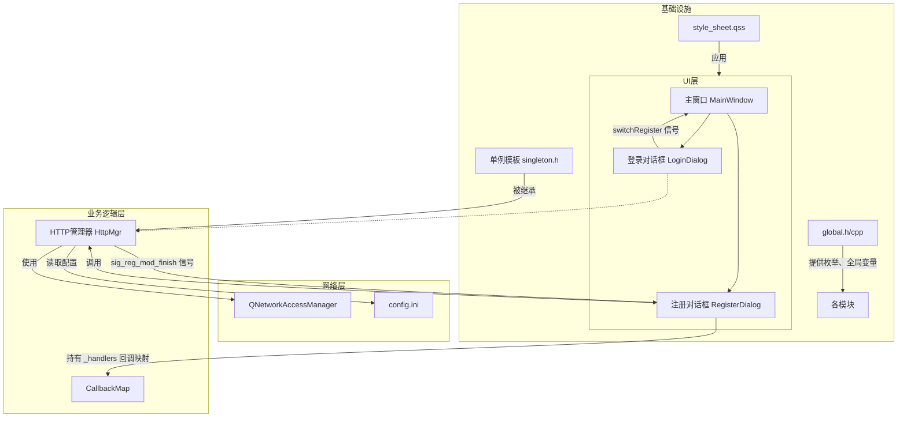
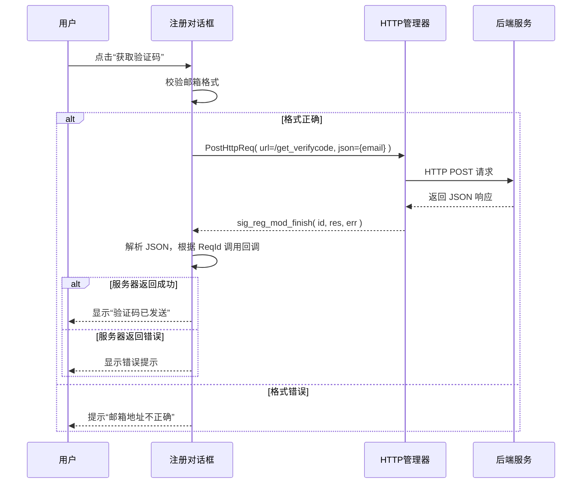

## 客户端架构1.0

包含 **分层架构图** 和 **注册验证码获取时序图** 两个视图。

---

## 1. 分层架构图（模块依赖与关系）

---

## 2. 注册验证码获取时序图（动态交互流程）

---

## 3. 架构特点简述（配合图示）

- **界面层**：`MainWindow` 作为容器，管理 `LoginDialog` 和 `RegisterDialog` 的切换，二者均设为无边框窗口。
- **业务逻辑层**：`RegisterDialog` 内部维护 `_handlers` 映射表，将请求 ID（`ReqId`）与回调函数绑定，实现响应处理的可扩展性；通过信号槽与 `HttpMgr` 通信。
- **网络层**：`HttpMgr` 采用线程安全的单例模式，封装 `QNetworkAccessManager`，统一处理 POST 请求，并通过模块标识（`Modules`）将响应分发给对应的对话框。
- **基础设施**：
  - `global.h` 提供全局枚举、变量和工具函数（如 `repolish`）。
  - `singleton.h` 提供可复用的单例模板。
  - 配置文件 `config.ini` 在 `main()` 中被读取，动态构建 `gate_url_prefix`。
  - 样式表 `style_sheet.qss` 在启动时加载，配合 `repolish` 实现动态样式刷新。

---

