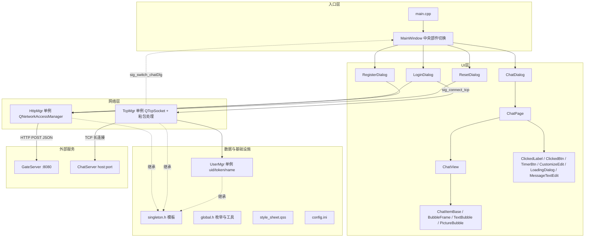
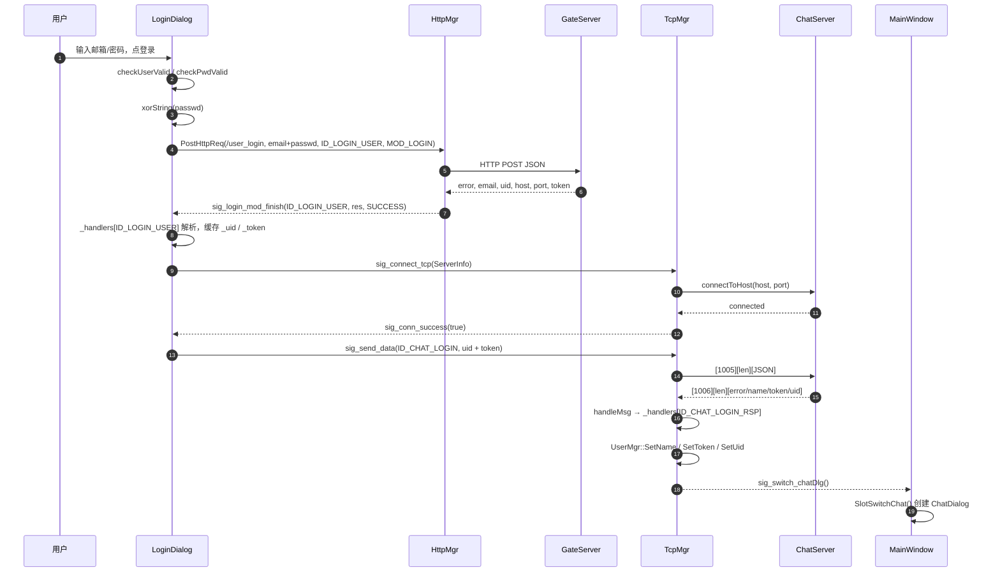
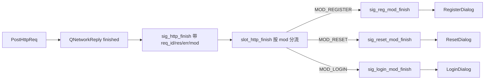
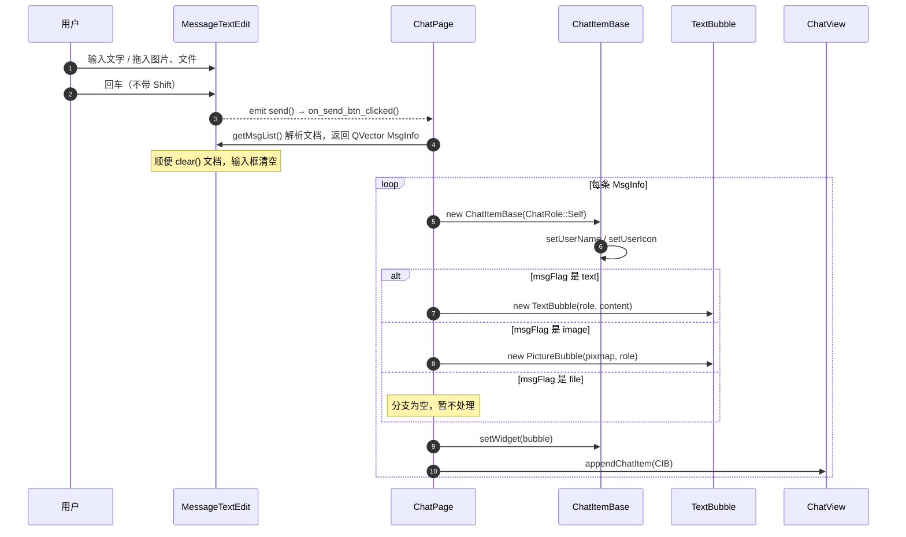
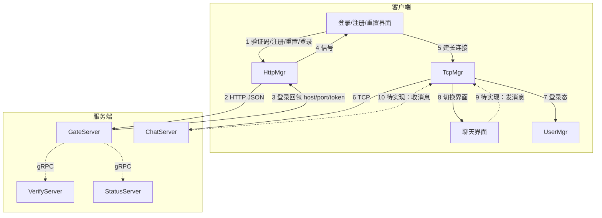

## 客户端架构 2.0

> **范围**：客户端内部实现 + 到网络接口为止（不展开 GateServer / ChatServer 内部逻辑）。
> **与 1.0 的关系**：1.0 只覆盖「登录 / 注册」链路，2.0 补齐聊天模块、TCP 长连接、消息渲染链，并新增现状问题清单。
> **对应代码**：`client/`，构建脚本 `client/client.pro`，Qt 6.11（Widgets + Network），C++17。
> **阅读方式**：第 1、2 章建立全局印象；第 3、6 章是理解本项目最关键的两块；第 9 章是复习时最该回头看的部分。

---

## 目录

1. 总览（技术栈、目录、分层图、类职责表）
2. 启动与界面切换
3. 网络层（到接口为止）
4. 数据层与基础设施
5. UI 层（界面、自定义控件、部件树）
6. 消息渲染链（重点）
7. 样式与资源
8. 端到端数据流总图
9. 现状问题清单与优化建议
10. 附录（枚举表、文件速查表、术语）

---

## 1. 总览

### 1.1 技术栈与构建

| 项 | 内容 |
| --- | --- |
| 框架 | Qt 6.11（`widgets` + `network`），纯 Widgets，不用 QML |
| 语言标准 | C++17（`CONFIG += c++17`） |
| 构建 | qmake（`client/client.pro`），输出到 `client/bin`；`.ui` 由 uic 生成，`.qrc` 由 rcc 打包 |
| 资源 | `client/rc.qrc`，前缀 `/`，含 `res/*` 图片与 `style/style_sheet.qss` |
| 配置 | `client/config.ini`，运行时从**可执行文件所在目录**读取，构建时由 qmake 的 `COPIES` 拷到输出目录 |
| 通信 | HTTP（GateServer，JSON）+ TCP 长连接（ChatServer，自定义帧 + JSON 包体） |
| 入口 | `client/main.cpp` |

目录说明：`client/build/...` 是 Qt Creator 的构建目录，`client/bin` 是 `client.pro` 里 `DESTDIR` 指定的输出目录，两者不要混。

### 1.2 目录结构

```
client/
├── main.cpp                  程序入口：加载 qss、读 config.ini、起 MainWindow
├── global.h / global.cpp     全局枚举、结构体、全局函数（repolish / xorString）
├── singleton.h               单例模板
├── httpmgr.*                 HTTP 网络层（GateServer）
├── tcpmgr.*                  TCP 网络层（ChatServer）
├── usermgr.*                 登录态数据（uid / token / name）
│
├── mainwindow.*              主窗口，四个界面之间切换
├── logindialog.*             登录
├── registerdialog.*          注册（含验证码倒计时、第二页提示页）
├── resetdialog.*             重置密码
│
├── chatdialog.*              聊天主界面（侧边栏 + 用户列表 + 页面栈）
├── chatpage.*                聊天会话页（消息区 + 输入区）
├── chatview.*                消息滚动区（气泡的容器）
├── chatuserlist.*            可加载更多的用户列表（QListWidget）
├── chatuserwid.*             用户列表条目
│
├── chatitembase.*            一条聊天消息的布局（头像 + 名字 + 气泡）
├── bubbleframe.*             气泡外框（背景 + 小三角）
├── textbubble.*              文本气泡
├── picturebubble.*           图片气泡
├── messagetextedit.*         消息输入框（图文混排 + 拖拽）
│
├── clickedlabel.*            支持 normal/hover/press/selected 的自定义 Label
├── clickedbtn.*              支持 normal/hover/press 的自定义按钮
├── timerbtn.*                带 10 秒倒计时的按钮（获取验证码）
├── customizeedit.*           带字节长度限制的 QLineEdit（搜索框用）
├── loadingdialog.*           加载中遮罩对话框
├── listitembase.*            列表条目基类（带条目类型）
│
├── config.ini                GateServer 地址/端口
├── rc.qrc                    资源清单
├── style/style_sheet.qss     全局样式表
└── res/                      图片、图标、gif
```

### 1.3 分层架构图



一句话概括数据流向：**UI 收集输入 → 网络层发出去 → 回包触发信号 → UI 自己的回调表处理 → 更新界面或写入 UserMgr**。UI 不直接读 socket / reply，网络层也不直接碰控件，两侧靠 Qt 信号解耦。

### 1.4 类职责速查表

| 类 | 文件 | 职责 | 关键依赖 |
| --- | --- | --- | --- |
| `MainWindow` | `mainwindow.*` | 承载四个界面，用 `setCentralWidget` 切换 | LoginDialog / RegisterDialog / ResetDialog / ChatDialog / TcpMgr |
| `LoginDialog` | `logindialog.*` | 登录表单、输入校验、发起 HTTP 登录、发起 TCP 长连接 | HttpMgr / TcpMgr |
| `RegisterDialog` | `registerdialog.*` | 注册表单、验证码倒计时、注册成功后切第二页 | HttpMgr |
| `ResetDialog` | `resetdialog.*` | 重置密码表单与校验 | HttpMgr |
| `HttpMgr` | `httpmgr.*` | 单例。发 JSON POST，把回包按模块分发信号 | QNetworkAccessManager / Singleton |
| `TcpMgr` | `tcpmgr.*` | 单例。长连接、粘包拆包、按消息 ID 回调、发包 | QTcpSocket / UserMgr / Singleton |
| `UserMgr` | `usermgr.*` | 保存登录态 uid / token / name | Singleton |
| `ChatDialog` | `chatdialog.*` | 聊天主界面：侧边栏、搜索框、用户列表、页面栈 | ChatUserList / ChatPage / LoadingDialog |
| `ChatPage` | `chatpage.*` | 一个会话页：消息区 + 输入区 + 发送按钮 | ChatView / MessageTextEdit / ChatItemBase / TextBubble |
| `ChatView` | `chatview.*` | 消息气泡的滚动容器，负责追加/清空条目、滚动到底部 | QScrollArea |
| `ChatUserList` | `chatuserlist.*` | 用户列表，滚到底部发 `sig_loading_chat_user` | QListWidget |
| `ChatUserWid` | `chatuserwid.*` | 列表条目：头像 + 昵称 + 最后一条消息 + 时间 | ListItemBase |
| `ChatItemBase` | `chatitembase.*` | 一条消息的网格布局：名字、头像、气泡三件套 | QGridLayout |
| `BubbleFrame` | `bubbleframe.*` | 气泡外框：圆角矩形 + 指向头像的小三角 | QFrame |
| `TextBubble` | `textbubble.*` | 文本气泡：按文本宽度定气泡宽度、按段落高度定高度 | QTextEdit / BubbleFrame |
| `PictureBubble` | `picturebubble.*` | 图片气泡：缩放后按图片尺寸定死大小 | QLabel / BubbleFrame |
| `MessageTextEdit` | `messagetextedit.*` | 输入框：回车发送、拖拽图片/文件、把文档拆成 `MsgInfo` 列表 | QTextEdit / MsgInfo |
| `ClickedLabel` | `clickedlabel.*` | 四态 Label，靠 `state` 动态属性驱动 qss | QLabel / repolish |
| `ClickedBtn` | `clickedbtn.*` | 三态按钮，同上 | QPushButton / repolish |
| `TimerBtn` | `timerbtn.*` | 点击后自锁 10 秒倒计时 | QTimer |
| `CustomizeEdit` | `customizeedit.*` | 限制输入字节数，失焦发信号 | QLineEdit |
| `LoadingDialog` | `loadingdialog.*` | 半透明加载遮罩 | QMovie |
| `ListItemBase` | `listitembase.*` | 列表条目基类，保存条目类型 + 支持 qss 背景 | QWidget |

---

## 2. 启动与界面切换

### 2.1 main.cpp 的启动顺序

1. 构造 `QApplication`。
2. 从资源里读 `:/style/style_sheet.qss`，整体 `setStyleSheet`，这就是全局样式的来源（不要再去逐个控件设样式，`repolish` 用的也是这套）。
3. 用 `QSettings` 读 `applicationDirPath()/config.ini` 里的 `GateServer/host` 与 `GateServer/port`，拼成全局变量 `gate_url_prefix = "http://host:port"`。
4. `MainWindow w; w.show();` 进入事件循环。

第 3 步要注意：`config.ini` 是按**可执行文件目录**找的，不是按源码目录。在 Qt Creator 里运行正常，是因为 `client.pro` 末尾的 `COPIES` 把它拷进了构建输出目录；手工拷 exe 时别忘了带上它，否则 `gate_url_prefix` 会退化成 `http://:`。

### 2.2 界面切换机制

`MainWindow` 的四个界面不是四个窗口，而是**同一个主窗口的中央部件**，靠 `setCentralWidget` 替换：

```mermaid
stateDiagram-v2
    [*] --> LoginDialog
    LoginDialog --> RegisterDialog : sig_switchRegister
    RegisterDialog --> LoginDialog : sigSwitchLogin
    LoginDialog --> ResetDialog : sig_switch_Reset
    ResetDialog --> LoginDialog : sig_switchLogin
    LoginDialog --> ChatDialog : TcpMgr::sig_switch_chatDlg
```

四个界面都设了 `Qt::CustomizeWindowHint | Qt::FramelessWindowHint`，也就是无边框窗口（主窗口自己画了标题栏样式），所以每个界面的 UI 里都自带返回/关闭按钮。

切换逻辑集中在 `MainWindow::SlotSwitchReg / SlotSwitchLogin / SlotSwitchReset / SlotSwitchLoginFromReset / SlotSwitchChat` 五个槽里，模式完全一致：

```cpp
new XxxDialog(this);          // 1. 新建
dlg->setWindowFlags(无边框);   // 2. 去边框
setCentralWidget(dlg);        // 3. 设为中央部件（旧的由 Qt 回收）
旧对话框->hide();              // 4. 隐藏旧的
dlg->show();                  // 5. 显示新的
connect(...);                 // 6. 补上信号连接
```

进入聊天界面时额外调整了窗口尺寸：`setMinimumSize(QSize(1050, 900))`，因为聊天界面需要更宽的布局。

> **已知隐患**：每次切换都 `new` 一个新对话框，而不是复用。`QMainWindow::setCentralWidget` 会把旧的中央部件 `hide()` 并投递 `deleteLater()`（已用最小工程实测确认：替换后旧对象在下一轮延迟删除中被销毁），所以在同一次调用链里继续写 `_login_dialog->hide()` 只是**恰好**安全——一旦中间跑过事件循环，成员指针就已经悬空。详见 9.2。

### 2.3 登录与进入聊天的完整时序



这张图里有一个很重要的设计点：**登录是"两段式"的**。

- 第一段走 HTTP 到 GateServer，只负责校验账号密码，并**返回 ChatServer 的地址（host/port）和 token**；
- 第二段走 TCP 直连 ChatServer，用 token 换聊天会话，回包成功后才真正切到聊天界面。

也就是说 GateServer 在这里扮演的是"鉴权 + 服务发现"，真正的聊天业务数据不在它上面跑。

---

## 3. 网络层（到接口为止）

### 3.1 HttpMgr：请求 → 信号 → 模块分发

`HttpMgr` 是 `Singleton<HttpMgr>` 单例，同时继承 `std::enable_shared_from_this`。核心方法只有一个：

```cpp
void PostHttpReq(QUrl url, QJsonObject json, ReqId req_id, Modules mod);
```

四个参数对应"发到哪、发什么、这是哪个功能、属于哪个模块"。发送与接收流程：

1. `QJsonDocument(json).toJson()` 序列化请求体，头部设 `Content-Type: application/json`。
2. `_manager.post(request, data)` 拿到 `QNetworkReply`。
3. 用 lambda 连 `QNetworkReply::finished`，**lambda 里捕获 `shared_from_this()`**（`auto self = shared_from_this();`），保证请求未完成时单例不会被析构。
4. 出错则 `emit sig_http_finish(req_id, "", ERR_NETWORK, mod)`；成功则 `emit sig_http_finish(req_id, readAll(), SUCCESS, mod)`。
5. `reply->deleteLater()` 回收 reply。

为什么要绕一层 `sig_http_finish` 再转成 `sig_reg_mod_finish` / `sig_reset_mod_finish` / `sig_login_mod_finish`？

因为**模块过滤在 HttpMgr 里做一次，界面就只需要订阅自己那一条信号**。否则每个界面都要连 `sig_http_finish` 再自己判断 `mod` 是不是自己的，重复且容易漏。这是本项目里最值得学的一处解耦设计。



### 3.2 界面侧的回调表模式

三个对话框（登录/注册/重置）用的是同一个套路：构造函数里 `initHttpHandlers()` 把 `ReqId → lambda` 存进 `_handlers`，槽函数里只做三件事——判错、解析 JSON、按 id 取回调执行。

```cpp
void RegisterDialog::slot_reg_mod_finish(ReqId id, QString res, ErrorCodes err)
{
    if (err != SUCCESS) { showTip(tr("网络请求错误"), false); return; }
    QJsonDocument jsonDoc = QJsonDocument::fromJson(res.toUtf8());
    if (jsonDoc.isNull() || !jsonDoc.isObject()) { showTip(tr("json解析失败"), false); return; }
    _handlers[id](jsonDoc.object());   // 只在这里分派
}
```

好处是**"收包/判错" 与 "具体业务" 分离**：同一个界面里多个功能（例如注册页的"获取验证码"和"提交注册"）共用一条信号，不会互相干扰。三个对话框写法一致，复习时看一个就够。

> 注意 `_handlers[id]` 用的是 `QMap::operator[]`，key 不存在时会**插入一个空的 `std::function` 再调用**，直接崩。目前能跑是因为服务端只会回客户端发过的 RequestId；严格来说应该改成 `find()` + 判空（`TcpMgr::handleMsg` 就是这么写的，见 3.4）。

### 3.3 HTTP 接口清单（客户端视角）

所有请求都是 **POST + JSON**，URL 前缀 = `gate_url_prefix`（来自 `config.ini`）。`passwd` / `confirm` 在发送前会经过 `xorString()` 处理（见 4.3）。

| 功能 | URL | 请求 JSON | 响应 JSON（客户端读取的字段） | ReqId | Modules | 发起位置 |
| --- | --- | --- | --- | --- | --- | --- |
| 获取验证码（注册） | `/get_verifycode` | `email` | `error, email` | `ID_GET_VERIFY_CODE` (1001) | `MOD_REGISTER` | `RegisterDialog::on_verify_btn_clicked` |
| 提交注册 | `/user_register` | `user, email, passwd, confirm, verifycode` | `error, email, uid` | `ID_REG_USER` (1002) | `MOD_REGISTER` | `RegisterDialog::on_confirm_btn_clicked` |
| 获取验证码（重置） | `/get_verifycode` | `email` | `error, email` | `ID_GET_VERIFY_CODE` (1001) | `MOD_RESET` | `ResetDialog::on_verify_btn_clicked` |
| 重置密码 | `/reset_pwd` | `user, email, passwd, verifycode` | `error, email, uid` | `ID_RESET_PWD` (1003) | `MOD_RESET` | `ResetDialog::on_sure_btn_clicked` |
| 用户登录 | `/user_login` | `email, passwd` | `error, email, uid, host, port, token` | `ID_LOGIN_USER` (1004) | `MOD_LOGIN` | `LoginDialog::on_login_btn_clicked` |

约定：

- `error` 为 `0`（`ErrorCodes::SUCCESS`）表示成功，非 0 由各界面自行提示。
- **同一个 `/get_verifycode` 被注册和重置两处复用**，靠 `Modules` 区分回包归属——这就是 `Modules` 枚举存在的意义。
- 登录成功回包里的 `host` / `port` / `token` 是给 TCP 长连接用的，`uid` 同时用于 HTTP 与 TCP。

### 3.4 TcpMgr：长连接、拆包、分发

`TcpMgr` 同样是单例，成员里直接持有一个 `QTcpSocket _socket`。

**连接**

```cpp
void TcpMgr::slot_tcp_connect(ServerInfo si) {
    _host = si.Host;
    _port = static_cast<uint16_t>(si.Port.toUInt());
    _socket.connectToHost(_host, _port);
}
```

连接成功后 `emit sig_conn_success(true)`，LoginDialog 收到后立刻发聊天登录包。

**接收与拆包（重点）**

TCP 是字节流：一次 `readyRead` 可能拿到半个包，也可能拿到两个半包。项目用 `_b_recv_pending` 标记"包头已解析、包体还没收全"，配合 `_buffer` 组成状态机：

```cpp
QObject::connect(&_socket, &QTcpSocket::readyRead, this, [this]() {
    _buffer.append(_socket.readAll());
    forever {
        if (!_b_recv_pending) {
            if (_buffer.size() < 4) return;        // 包头都不够，等下一批
            QDataStream s(&_buffer, QIODevice::ReadOnly);
            s >> _message_id >> _message_len;      // 读 2B id + 2B len
            _buffer.remove(0, 4);                  // QDataStream 不消费 buffer，要手动移除
        }
        if (_buffer.size() < _message_len) {
            _b_recv_pending = true;                // 包体没收全，记住状态
            return;
        }
        QByteArray body = _buffer.left(_message_len);
        _buffer.remove(0, _message_len);
        _b_recv_pending = false;
        handleMsg(ReqId(_message_id), _message_len, body);
    }
});
```

这段代码有两个必须记住的坑，都是课本级的：

1. **`QDataStream` 不会消费 `QByteArray`**，它只是在上面做视图式读取，所以读完包头必须自己 `remove(0, 4)`。
2. **必须能在 `readyRead` 里循环**，因为一次回调可能收到多个完整包；用 `forever` + `return` 表示"数据不够就退出，等下一次 readyRead 续上"。

**分发**

```cpp
void TcpMgr::handleMsg(ReqId id, int len, QByteArray data) {
    auto it = _handlers.find(id);
    if (it == _handlers.end()) { qDebug() << "not found id"; return; }
    it.value()(id, len, data);
}
```

和界面侧的 `_handlers` 是同一个套路，区别是这里的 key 是**消息 ID**，而且用了 `find()` 判空（比 HTTP 侧严谨）。

`initHandlers()` 在**构造函数里**被调用，所以里面的 lambda 只能捕获 `this`，不能捕获 `shared_from_this()`——那时对象还没构造完，`shared_from_this()` 会抛 `bad_weak_ptr`。代码注释里专门写了这一点，属于必须记住的经验：

```cpp
void TcpMgr::initHandlers() {
    // 要使用 shared_from_this 的前提是类已构造完全，
    // 而我们在构造函数里调用 initHandlers，所以这里只能捕获 this
    _handlers[ReqId::ID_CHAT_LOGIN_RSP] = [this](ReqId id, int len, QByteArray data) { ... };
}
```

**发送**

```cpp
void TcpMgr::slot_send_data(ReqId reqId, QString data) {
    uint16_t id = reqId;
    QByteArray dataBytes = data.toUtf8();
    quint16 len = static_cast<quint16>(dataBytes.size());

    QByteArray block;
    QDataStream out(&block, QIODevice::WriteOnly);
    out.setByteOrder(QDataStream::BigEndian);
    out << id << len;
    block.append(dataBytes);
    _socket.write(block);
}
```

注意 `sig_send_data` 在构造函数里自连接到了 `slot_send_data`，所以外部只需要：

```cpp
emit TcpMgr::GetInstance()->sig_send_data(ReqId::ID_CHAT_LOGIN, jsonstr);
```

这是"用信号当发送 API"的写法（`emit` 别人对象的信号在 Qt 里合法），好处是调用方不需要持有 TcpMgr 指针，坏处是阅读时容易误以为它只是普通信号。

### 3.5 TCP 消息清单与帧格式

**帧格式**（收发一致，大端序）：

| 字段 | 长度 | 说明 |
| --- | --- | --- |
| `msg_id` | 2 字节 uint16 | 消息 ID（`ReqId`） |
| `msg_len` | 2 字节 uint16 | 包体字节数 |
| `body` | msg_len 字节 | UTF-8 编码的 JSON |

**已实现的消息**：

| 方向 | ReqId | 包体 | 触发时机 | 处理位置 |
| --- | --- | --- | --- | --- |
| 客户端 → ChatServer | `ID_CHAT_LOGIN` (1005) | `{uid, token}`（`QJsonDocument::Indented`） | TCP 连接成功后由 LoginDialog 发出 | `LoginDialog::slot_tcp_conn_finish` |
| ChatServer → 客户端 | `ID_CHAT_LOGIN_RSP` (1006) | `{error, name, token, uid}` | 聊天服务登录结果 | `TcpMgr::initHandlers` 里的 lambda |

聊天登录响应处理做了三件事：校验 `error` → 写入 `UserMgr` → `emit sig_switch_chatDlg()` 通知 MainWindow 切界面；失败则 `emit sig_login_failed(err)` 回到 LoginDialog 提示。

**和 protobuf / gRPC 的关系（容易混淆，单独说明）**

仓库里的 `server/proto/message.proto`（`LoginReq` / `LoginRsp` / `GetChatServerReq` 等）是 **GateServer / StatusServer / VerifyServer 之间**的 gRPC 接口。**客户端完全不使用 protobuf**：`client.pro` 里没有 protobuf 依赖，客户端与 ChatServer 之间跑的是"自定义帧 + JSON 文本"。

这也带来一处需要注意的**契约差异**：客户端从登录回包里读 `name` 字段，而 `message.proto` 的 `LoginRsp` 只有 `error / uid / token`。也就是说，**客户端协议和服务端内部协议是两套东西，需要各自维护一份字段表**——这正是本文 3.3 / 3.5 两张表存在的意义。

---

## 4. 数据层与基础设施

### 4.1 UserMgr

只存三个字段：`_name`、`_token`、`_uid`，提供三个 `Set` 方法。目前**没有 getter**，也就是说除了写进去，还没有任何地方把登录态读出来用（发消息、拉好友列表都会用到，属于下一步要补的）。

它是聊天会话的"进程内登录态"，重启即丢，没有落盘。

### 4.2 Singleton 模板

```cpp
template <typename T>
class Singleton {
protected:
    Singleton() = default;
    Singleton(const Singleton<T>&) = delete;
    Singleton& operator=(const Singleton<T>&) = delete;
    static std::shared_ptr<T> _instance;
public:
    static std::shared_ptr<T> GetInstance() {
        static std::once_flag s_flag;
        std::call_once(s_flag, [&]() { _instance = std::shared_ptr<T>(new T); });
        return _instance;
    }
};
```

要点：

- 用 `std::call_once` 保证只构造一次（线程安全），比"双检锁"更容易写对。
- 返回 `shared_ptr<T>` 而不是裸指针或引用，配合 `enable_shared_from_this` 让异步回调能安全续命（HttpMgr 的 lambda 就是这么用的）。
- 子类必须三件套：继承 `Singleton<T>`、`friend class Singleton<T>`、构造函数私有。`HttpMgr` / `TcpMgr` / `UserMgr` 都是这个模板。
- 副作用：谁都能通过拿到手的 `shared_ptr` 延长单例生命周期，`_instance` 不会在预期时机释放（析构里那句 `cout` 基本不会在正常退出前打印）。

### 4.3 global.h / global.cpp

集中放了三类东西：

1. **枚举**：`ReqId`（请求/消息 ID，1001~1006）、`Modules`（模块归属）、`ErrorCodes`（仅 `SUCCESS` / `ERR_JSON` / `ERR_NETWORK`）、`TipErr`（前端输入校验错误类型）、`ClickLbState`、`ChatUIMode`、`ListItemType`、`ChatRole{Self, Other}`。
2. **结构体**：`ServerInfo{Host, Port, Token, Uid}`（HTTP 登录回包 → TCP 连接的载体）、`MsgInfo{msgFlag, content, pixmap}`（输入框解析出的一条待发送内容）。
3. **全局函数与变量**：`repolish(QWidget*)`、`xorString(QString)`，以及 `gate_url_prefix`。

`repolish` 是"改动态属性后刷新 qss"的固定姿势：

```cpp
std::function<void(QWidget*)> repolish = [](QWidget* w){
    w->style()->unpolish(w);
    w->style()->polish(w);
};
```

`ClickedLabel` / `ClickedBtn` 改完 `state` 属性后调用它，qss 才会重新匹配；`showTip()` 改颜色提示也是靠这个。

`xorString` 是把每个字符与"字符串长度的低 8 位"做异或：

```cpp
std::function<QString(QString)> xorString = [](QString input){
    QString result = input;
    int length = result.length() % 255;
    for (int i = 0; i < input.length(); i++)
        result[i] = QChar(static_cast<ushort>(input[i].unicode() ^ static_cast<ushort>(length)));
    return result;
};
```

**这不是加密**：密钥就是长度本身，属于可逆混淆，只能防"抓包一眼看到明文密码"。真正的安全性要靠 HTTPS（见 9.2）。

> 另外 `global.h` 里 `#include <QNetworkReply>` 会让所有包含它的文件都必须链接 `QtNetwork`——连只画气泡的 `textbubble.cpp` 都被迫依赖网络模块。见 9.3。

---

## 5. UI 层

### 5.1 界面与部件树

```
MainWindow (QMainWindow, mainwindow.ui)
└── centralwidget  ← 运行时被 setCentralWidget 替换为下面四个之一
    ├── LoginDialog      widget / head_label / email_lineEdit / pass_lineEdit
    │                    forget_label(ClickedLabel) / login_btn / reg_btn / err_tip
    ├── RegisterDialog   stackedWidget{ page_1(表单: user_edit/email_edit/pass_edit/
    │                                 ack_edit/verify_edit/verify_btn/TimerBtn/confirm_btn)
    │                                 page_2(成功提示 + tip_label 倒计时) }
    ├── ResetDialog      user_edit / email_edit / pwd_edit / verify_edit
    │                    verify_btn / sure_btn / return_btn / err_tip
    └── ChatDialog
        ├── side_bar_widget      side_chat_label / side_contact_label / side_head_label
        ├── chat_user_widget
        │   ├── search_widget    CustomizeEdit(search_edit) + ClickedBtn(add_btn)
        │   ├── ChatUserList     chat_user_list   ← 用户列表
        │   ├── QListWidget      search_list      ← 搜索结果（仅显示/隐藏）
        │   └── QListWidget      con_user_list    ← 联系人（仅显示/隐藏）
        └── stackedWidget
            ├── ChatPage  chat_page         ← 会话页
            └── QWidget   friend_apply_page ← 好友申请页（空壳）

ChatPage (chatpage.ui)
├── chat_data_widget
│   ├── title_widget      title_label（当前会话对象名字）
│   └── ChatView          chat_data_list   ← 消息滚动区
└── tool_widget
    ├── ClickedLabel      emo_label   （表情，未接逻辑）
    ├── ClickedLabel      file_label  （文件，未接逻辑）
    ├── MessageTextEdit   chat_edit   ← 输入框
    └── send_widget
        ├── ClickedBtn    receive_btn （未接逻辑）
        └── ClickedBtn    send_btn    → on_send_btn_clicked

ChatView (chatview.ui)
└── QScrollArea chat_area
    └── QWidget chat_bg   ← QVBoxLayout，尾部常驻一个 Spacer
        ├── ChatItemBase（历史消息…）
        └── QSpacerItem（永远在最后一个，appendChatItem 插在它之前）

ChatItemBase（每条消息，代码构建，无 .ui）
└── QGridLayout
    ├── m_pNameLabel  名字（Self 右对齐 / Other 左对齐）
    ├── m_pIconLabel  头像 42x42
    └── m_pBubble     ← setWidget() 换成具体气泡

BubbleFrame（气泡外框，代码构建）
└── QHBoxLayout（内容边距里预留了 8px 给小三角）
    ├── TextBubble     → QTextEdit（只读、无边框、透明底）
    └── PictureBubble  → QLabel
```

另外 `ChatUserWid`（`chatuserwid.ui`）是用户列表条目的固定版式：`icon_lb`（头像）+ `user_name_lb`（昵称）+ `user_chat_lb`（最后一条消息）+ `time_lb`（时间），`sizeHint()` 固定 `250x70`。

### 5.2 自定义控件的统一套路：动态属性 + qss

`ClickedLabel` / `ClickedBtn` / `ListItemBase` / `ChatUserWid` 全部遵循同一条规则：

```cpp
setProperty("state", "hover");   // 1. 改动态属性
repolish(this);                  // 2. 刷新样式
update();                        // 3. 重绘
```

qss 里则写成属性选择器：

```css
#send_btn[state='normal'] { }
#send_btn[state='hover']  { }
#send_btn[state='press']  { }
```

这是本项目 UI 层最核心的一条约定：**状态切换不用 `setStyleSheet` 拼字符串，而是改属性 + repolish**。

| 控件 | 状态机 | 说明 |
| --- | --- | --- |
| `ClickedLabel` | Normal ↔ Selected，每种状态各有 normal/hover/press | 用于"忘记密码"、"密码可见"、侧边栏等；按下即取反，松开才 `emit clicked()` |
| `ClickedBtn` | normal / hover / press | 用于发送、添加好友等按钮 |
| `TimerBtn` | 自锁 10 秒 | `mouseReleaseEvent` 里 `setEnabled(false)` + 启动 QTimer，倒计时结束恢复；手动 `emit clicked()` 保证外部 connect 依然有效 |
| `CustomizeEdit` | — | `SetMaxLength(n)` 按 **UTF-8 字节数**截断，失焦发 `sig_foucus_out()` |
| `LoadingDialog` | — | 无边框 + 半透明 + 置顶，用 `QMovie` 播 gif，`setFixedSize(parent->size())` 覆盖父窗口 |

`ListItemBase` 额外做了一件事：重写 `paintEvent` 调用 `style()->drawPrimitive(QStyle::PE_Widget, ...)`。这是让**纯 QWidget 子类也能吃到 qss 背景**的标准做法（`ChatPage`、`ChatView` 也一样）。

### 5.3 聊天主界面 ChatDialog

`ChatDialog` 管三件事：

1. **搜索框**：`CustomizeEdit(search_edit)` 最大 15 字节 + 前后两个 `QAction` 图标（放大镜、清除）。清除图标一开始是透明的 `close_transparent.png`，有输入时换成 `close_search.png`，点击后清空并收起搜索。
2. **三种列表的显示切换**：`ShowSearch(bool)` 在 `chat_user_list` / `search_list` / `con_user_list` 之间 show/hide，并维护 `_mode` / `_state` 两个 `ChatUIMode`。
3. **加载更多**：`ChatUserList` 滚到底部发 `sig_loading_chat_user`，`ChatDialog::slot_loading_chat_user` 弹 `LoadingDialog` 再追加数据。

> **注意**：`side_chat_label` / `side_contact_label` 在 .ui 里是**普通 QLabel**（没有提升为 ClickedLabel），`_state` 也没有任何地方赋值，所以"聊天 / 联系人"侧边栏切换目前**没有接线**，只有聊天列表是活的。

`ChatUserList` 本体是个 `QListWidget`，做了两处增强：

- 鼠标进入 viewport 才显示垂直滚动条（`ScrollBarAsNeeded`），离开就隐藏；
- 拦截滚轮事件，滚到底部时 `emit sig_loading_chat_user()`。

### 5.4 消息区 ChatView

`ChatView` 的职责是"管一个 `QVBoxLayout`"：

```cpp
void ChatView::appendChatItem(QWidget *item) {
    QVBoxLayout *vl = qobject_cast<QVBoxLayout *>(ui->chat_bg->layout());
    vl->insertWidget(vl->count() - 1, item);   // 永远插在尾部 Spacer 之前
    isAppended = true;
}
```

配套的还有 `prependChatItem` / `insertChatItem`（未实现，留了 TODO）和 `removeAllItem()`（清空时保留最后一个 Spacer，否则布局会塌）。

自动滚到底部的实现是：监听垂直滚动条的 `rangeChanged`，如果刚追加过（`isAppended`）就把滑块拉到 `maximum()`，然后用 `QTimer::singleShot(500, ...)` 复位 `isAppended`，避免"添加 item 会触发多次 rangeChanged"导致反复强制滚动。

> 这是典型的"能跑但脆"的写法：用 500ms 时间窗代替明确的状态。见 9.3。

---

## 6. 消息渲染链（重点）

这是本项目 UI 里最值得逐行读的部分，也是出 bug 最多的地方。

### 6.1 从输入到气泡



### 6.2 MessageTextEdit：输入框里的"图文混排"

`MessageTextEdit` 继承 `QTextEdit`，主要做了四件事：

1. **回车发送**：`keyPressEvent` 里拦 `Enter` / `Return`（不带 Shift），`emit send()` 并且**不调用基类**，所以不会往文档里插入换行；带 Shift 的回车走基类，正常换行。
2. **拖拽**：`dragEnterEvent` 只接受外部来源（`event->source() != this`），`dropEvent` 交给 `insertFromMimeData`。
3. **插入图片 / 文件**：图片按最大 120x80 等比缩放后用 `cursor.insertImage(image, url)` 插进文档；文件则先用 `QFileIconProvider` 画出一张"图标 + 文件名 + 大小"的 `QPixmap` 再插入。两者都会在 `mMsgList` 里追加一条 `MsgInfo`。
4. **导出消息列表**：`getMsgList()` 遍历 `document()->toPlainText()`，遇到 `QChar::ObjectReplacementCharacter`（占位符，代表一张内嵌图片）就认为"这里是一个文件/图片"，把前面攒的纯文本先作为一条 `text` 消息推入结果，然后按顺序从 `mMsgList` 里取一条匹配的 `image`/`file` 消息；遍历完再把尾巴上的文本补上，最后清空文档并返回列表。

`MsgInfo` 就是这条链上的通用载体：

```cpp
struct MsgInfo {
    QString msgFlag;   // "text" / "image" / "file"
    QString content;   // 文本内容，或图片/文件的 URL
    QPixmap pixmap;    // 图片/文件缩略图
};
```

> **两个已知弱点**：一是判断顺序时用 `document()->toHtml().contains(msg.content)` 做匹配（O(n²)，理论上会被同名文件干扰）；二是 `mMsgList` 与文档之间没有同步机制——用户删掉已插入的图片/文件后 `mMsgList` 不会更新，只能靠"按顺序匹配"兜底。见 9.3。

### 6.3 气泡体系：三层结构

```
ChatItemBase          负责一条消息的整体布局（名字 / 头像 / 气泡三栏网格）
   └── BubbleFrame    负责气泡外观（圆角背景 + 指向头像的小三角）
          └── TextBubble / PictureBubble   负责内容本体
```

**ChatItemBase** 用 `QGridLayout` 按角色排布：`ChatRole::Self` 时头像放右边、名字右对齐，`Other` 时相反；未占用的那一侧用 `QSpacerItem(QSizePolicy::Expanding)` 顶开，配合 `setColumnStretch` 实现"气泡靠边、留白在中间"的聊天效果。

`setWidget(QWidget *w)` 的写法值得注意：先把气泡 `replaceWidget` 进布局，再 `delete m_pBubble`（那个占位用的空 QWidget），否则会漏。这就是"先替换再删除"的固定套路。

**BubbleFrame** 在构造函数里就按角色设定内容边距，给绘制小三角留位置：

```cpp
if (m_role == ChatRole::Self)
    m_pHLayout->setContentsMargins(m_margin, m_margin, WIDTH_SANJIAO + m_margin, m_margin);
else
    m_pHLayout->setContentsMargins(WIDTH_SANJIAO + m_margin, m_margin, m_margin, m_margin);
```

`paintEvent` 里画两件事：一个左右各让出 8px（`WIDTH_SANJIAO`）的圆角矩形，和一个在顶部靠头像一侧的三角形。自己（Self）是绿色 `rgb(158,234,106)`，对方是白色。

> `BubbleFrame::setMargin()` 是空实现（`Q_UNUSED(margin)`），改边距的唯一途径是构造时传入的角色。属于历史残留。

**TextBubble** 是这套体系里最"数学"的一个，也是 2.0 修过 bug 的地方，下一节单独讲。

**PictureBubble** 简单直接：图片按 160x90 等比缩放后塞进 `QLabel`，然后 `setFixedSize(pix.width()+左右边距, pix.height()+上下边距*2)` 把气泡尺寸钉死。

### 6.4 气泡尺寸计算与一个真实 bug 的复盘

`TextBubble` 由两个函数决定尺寸：

```cpp
void TextBubble::setPlainText(const QString &text)   // 决定气泡宽度（setMaximumWidth）
void TextBubble::adjustTextHeight()                  // 决定气泡高度（setFixedHeight）
```

**高度**：在 `eventFilter` 里监听 `QTextEdit` 的 `Paint` 事件，累加每个 `QTextBlock` 的 `QTextLayout::boundingRect().height()`，再加上文档边距与布局上下边距，然后 `setFixedHeight`。之所以放在 Paint 事件里，是因为只有此时段落布局才是最新的。

**宽度（2.0 修复项）**：原实现遍历每个段落，用 `QFontMetricsF::horizontalAdvance()` 量出最宽的一段，然后：

```cpp
// 修复前（有 bug）
const int txtW = static_cast<int>(fm.horizontalAdvance(it.text()));
max_width = std::max(max_width, txtW);
setMaximumWidth(static_cast<int>(max_width + doc_margin * 2) + margin_left + margin_right);
```

`horizontalAdvance()` 返回的是**小数**（例如 `abcde` 在 Microsoft YaHei 12pt、150% 缩放下是 `46.3906`），`static_cast<int>` 一截断就变成 `46`，气泡宽度因此比文本实际需要的宽度**少不到 1px**。而 `QTextEdit` 默认换行模式是 `WrapAtWordBoundaryOrAnywhere`，于是：

- 最后一个字符被挤到下一行：`abcde` 显示成 `abcd` + 换行 + `e`；
- 文本里有空格时，空格是天然的断行点，会先在空格处换行。

**判断依据**（实测数据，复习时对照用）：

| 文本 | 实际需要宽度 | 截断后 | 修复前 | 修复后 |
| --- | --- | --- | --- | --- |
| `abcde` | 46.3906 | 46 | 2 行 | 1 行 |
| `hello world` | 85.6719 | 85 | 2 行（空格处断） | 1 行 |
| `你好世界` | 64.0（正好整数） | 64 | 1 行 | 1 行 |

最后一行是决定性证据：**只有宽度恰好是整数的文本不换行**。屏幕缩放为 125%/150% 时字形宽度几乎必然带小数，所以这个 bug 在高 DPI 机器上必现，在 100% 缩放下反而可能看不到。

```cpp
// 修复后
const qreal txtW = fm.horizontalAdvance(it.text());
max_width = std::max(max_width, txtW);

const qreal text_width = std::ceil(max_width) + 2;   // 向上取整 + 2px 余量
setMaximumWidth(static_cast<int>(text_width + doc_margin * 2) + margin_left + margin_right);
```

**结论（可推广）**：凡是把 `QFontMetrics(F)` 的量测结果 `static_cast<int>` 的地方都要警惕，应当 `std::ceil()` 后留 1~2px 余量。这类误差在 100% 缩放下经常被掩盖，一旦用户开高 DPI 就暴露。

> 更彻底的方案是不要自己量文本，而是给气泡设一个统一的 `maxWidth`（例如 420px）让 `QTextDocument` 自己换行。现在的做法是"短消息按内容宽度撑开、长消息按容器宽度换行"，会让超长消息撑得很宽。见 9.3。

---

## 7. 样式与资源

- **样式**：全部集中在 `client/style/style_sheet.qss`，由 `main.cpp` 一次性 `setStyleSheet` 到整个应用。
  - 属性选择器驱动状态：`#send_btn[state='hover']`、`#err_tip[state='err']` 等；
  - 列表项：`#chat_user_list::item:hover` / `::item:selected`；
  - 滚动条：全局把垂直滚动条压成 8px 宽、隐藏上下箭头。
  - 改动态属性后**必须 `repolish`**，否则样式不会更新。
- **资源**：`rc.qrc` 前缀为 `/`，所以代码里统一写 `":/res/xxx.png"`、`":/style/style_sheet.qss"`。
- **图标**：`client.pro` 里 `RC_ICONS = icon.ico` 设置 exe 图标。
- **配置文件**：`config.ini` 通过 `COPIES` 在构建时复制到输出目录；`DISTFILES` 只是让 Qt Creator 里能看到它，不参与构建。

---

## 8. 端到端数据流总图



虚线的 9、10 两步正是当前最大的功能缺口（见 9.1）。

---

## 9. 现状问题清单与优化建议

按"影响功能正确性 → 影响健壮性 → 影响可维护性"排序。每条都标了证据位置，方便回头改。

### 9.1 P0：功能缺口与确定性错误

| # | 问题 | 证据 | 建议 |
| --- | --- | --- | --- |
| 1 | **消息收发没有闭环**：点发送只在本地生成气泡，没有调用 `TcpMgr` 发给服务端；`TcpMgr::_handlers` 里也只注册了登录响应，收到对端消息会走 `not found id` 分支。目前聊天界面属于"本地演示"。 | `chatpage.cpp on_send_btn_clicked`、`tcpmgr.cpp initHandlers` | 定义消息 ID（如 `ID_SEND_MSG` / `ID_RECV_MSG`），在 `ChatPage` 里 `emit TcpMgr::GetInstance()->sig_send_data(...)`，并在 `initHandlers` 里加接收分支 → 交给 `ChatView::appendChatItem` |
| 2 | **文件消息分支是空的**：`if (type == "file")` 里没有任何代码，拖入文件后不会有气泡。 | `chatpage.cpp` | 仿照 `PictureBubble` 做一个 `FileBubble`，或先给用户明确提示"暂不支持" |
| 3 | **聊天列表是假数据且会重复**：`addChatUserList()` 用随机数造 13 条；列表滑到底部会不断触发 `sig_loading_chat_user`，每触发一次就再追加 13 条重复项，没有"数据已加载完"的判断。 | `chatdialog.cpp addChatUserList / slot_loading_chat_user` | 接入真实好友列表；增加"没有更多"状态并停止发信号 |
| 4 | **字节截断会把中文/emoji 切半**：`CustomizeEdit::limitTextLength` 直接 `byteArray.left(_max_len)`，可能切断一个多字节字符，`fromUtf8` 之后变成乱码（搜索框设的是 15）。 | `customizeedit.h limitTextLength` | 用 `QString::left(n)` 按**字符**截断，或循环回退到合法 UTF-8 边界 |
| 5 | **侧边栏切换未接线**：`side_chat_label` / `side_contact_label` 在 .ui 里是普通 QLabel，`_state` 从未被赋值，联系人页 `con_user_list` 永远是空的。 | `chatdialog.ui`、`chatdialog.cpp` | 提升为 `ClickedLabel` 并补上状态切换与数据源 |

> 第 4 条和第 6 章那次 `TextBubble` 的 bug 属于同一族问题：**对"宽度/长度"做了不安全的截断**（一个是像素取整，一个是字节切分）。

### 9.2 P1：健壮性与协议一致性

| # | 问题 | 证据 | 建议 |
| --- | --- | --- | --- |
| 6 | **对话框反复 new，成员指针会短暂悬空**：每次切换都 `new` 一个新对话框，旧实例由 `QMainWindow::setCentralWidget` 投递 `deleteLater()` 回收（已实测确认）。切换函数里紧跟的 `_login_dialog->hide()` 只是**恰好**安全——`deleteLater` 延迟到下一轮事件循环，一旦中间跑过事件循环就会操作已析构对象。 | `mainwindow.cpp` 各 `SlotSwitchXxx` | 四个界面只创建一次，用 `QStackedWidget` 或 `hide/show` 切换；至少把成员换成 `QPointer<>` 并在切换后置空 |
| 7 | **调试遗留代码**：`MainWindow` 构造函数里直接 `emit TcpMgr::GetInstance()->sig_switch_chatDlg();`，程序一启动就跳过登录进聊天界面。 | `mainwindow.cpp` 构造函数 | 删除；需要调试时用宏包起来 |
| 8 | **客户端协议与服务端 proto 不一致**：客户端按 JSON 解析登录响应里的 `name`，而 `message.proto` 的 `LoginRsp` 只有 `error / uid / token`。 | `tcpmgr.cpp ID_CHAT_LOGIN_RSP` 分支、`server/proto/message.proto` | 固定一份"客户端协议"字段表（本文 3.3 / 3.5），客户端与服务端按它各自实现 |
| 9 | **长连接没有心跳、超时与重连**：`disconnected` 只打日志，界面不会退回登录态；`errorOccurred` 也只打日志。 | `tcpmgr.cpp` 构造函数 | 加心跳定时器 + 断线重连退避 + 断线时切回登录界面 |
| 10 | **包长用 `uint16`**：单包上限 65535 字节，超长内容会被 `static_cast<quint16>` 截断，收发两端都会错位。 | `tcpmgr.cpp slot_send_data` | 大文件/长消息分片，或把长度字段改成 `uint32`（需两端同时改） |
| 11 | **HTTP 没有超时与重试**：`QNetworkRequest` 未设 `setTransferTimeout`，弱网下按钮会一直处于禁用态。 | `httpmgr.cpp PostHttpReq` | 设置传输超时，超时后恢复按钮并提示 |
| 12 | **`_handlers[id]` 用下标访问**：key 不存在时会插入空 `std::function` 再调用，直接崩溃（TCP 侧用了 `find()` 判空，HTTP 侧没有）。 | 三个对话框的 `slot_xxx_mod_finish` | 统一改成 `find()` + 判空，并打印未知 id |
| 13 | **`xorString` 不是加密**：密钥是字符串长度，可逆且可猜；HTTP 还是明文传输。 | `global.cpp` | 明确它只是混淆；安全性依赖后续上 HTTPS |

### 9.3 P2：工程质量与可维护性

| # | 问题 | 证据 | 建议 |
| --- | --- | --- | --- |
| 14 | **`global.h` 污染依赖**：它 `#include <QNetworkReply>`，导致所有包含它的文件都必须链接 `QtNetwork`（如 `textbubble.cpp` 只是画气泡）。 | `global.h` | 把网络相关头文件从 `global.h` 移除，需要的地方各自 include |
| 15 | **聊天数据没有模型层**：会话、消息、好友全在内存里，没有持久化，重启即丢；`ChatUserWid` 用 `QListWidget::setItemWidget` 逐条构造 widget，列表规模上来后内存与性能都会退化。 | `chatdialog.cpp`、`chatuserwid.*` | 抽出 `Session` / `Message` 数据模型，改用 `QAbstractItemModel` 或 `QListView` + delegate |
| 16 | **ChatView 的滚动条是"搬"出来的**：把 `QScrollArea` 自带的垂直滚动条塞进一个 `QHBoxLayout`（`ui->chat_area->setLayout(pHLayout_2)`），显示/隐藏靠 `eventFilter`，滚动到底靠 `QTimer::singleShot(500)` 复位标志位。 | `chatview.cpp` | 改用 qss / 自定义 `QAbstractScrollArea` 控制滚动条；用明确的状态代替 500ms 时间窗 |
| 17 | **`getMsgList()` 的顺序匹配不可靠**：用 `document()->toHtml().contains(msg.content)` 判断图片/文件顺序，O(n²) 且依赖 HTML 文本。 | `messagetextedit.cpp getMsgList` | 遍历文档时按占位符顺序直接取 `QTextImageFormat` 的 url 列表，按序取出即可 |
| 18 | **错误提示逻辑三处重复且行为不一致**：`showTip` / `AddTipErr` / `DelTipErr` 在三个对话框里各写一遍，`ResetDialog::DelTipErr` 还会显示 `_tip_errs.first()`，另外两个直接 clear。 | 三个对话框 cpp | 抽一个 `TipMgr` 或公共基类 |
| 19 | **UI 逻辑写在自动连接槽里**：大量 `on_xxx_clicked` 由 .ui 自动连接，业务与视图耦合，无法单测。 | 各对话框 | 把校验与请求逻辑抽到独立函数，槽只做转调 |
| 20 | **没有测试**：客户端零自动化测试。网络层的拆包逻辑（`_b_recv_pending` 状态机）是最适合写单测的部分——它不依赖界面，只要喂字节流即可。 | — | 用 `Qt Test` 给拆包写用例：半包、粘包、超长包各一条 |
| 21 | **历史残留**：`BubbleFrame::setMargin()` 空实现、`ChatDialog::friend_apply_page` 空壳、`emo_label` / `receive_btn` 未接逻辑、`ChatView::prependChatItem` / `insertChatItem` 是 TODO。 | 各文件 | 要么补实现，要么删掉，避免误读 |

### 9.4 建议的推进顺序

1. **打通闭环（P0）**：定义消息 ID 与 JSON 字段表 → 客户端发消息 → 服务端回消息 → `ChatView` 渲染。这一步做完，聊天才算"能用"。
2. **补数据层**：`Session` / `Message` 模型 + 本地缓存，让历史消息留下来，为 UI 换成 `QAbstractItemModel` 做准备。
3. **补健壮性**：心跳、断线重连、超时、错误码表、未知消息 ID 兜底。
4. **收工程债**：拆 `global.h`、`MainWindow` 改成页面栈复用、给拆包写单测、统一错误提示。

---

## 10. 附录

### 10.1 枚举与常量

| 名称 | 值 | 用途 |
| --- | --- | --- |
| `ID_GET_VERIFY_CODE` | 1001 | HTTP 获取验证码 |
| `ID_REG_USER` | 1002 | HTTP 注册 |
| `ID_RESET_PWD` | 1003 | HTTP 重置密码 |
| `ID_LOGIN_USER` | 1004 | HTTP 登录 |
| `ID_CHAT_LOGIN` | 1005 | TCP 聊天服务登录（客户端 → ChatServer） |
| `ID_CHAT_LOGIN_RSP` | 1006 | TCP 聊天服务登录响应 |
| `MOD_REGISTER` / `MOD_RESET` / `MOD_LOGIN` | 0 / 1 / 2 | HTTP 回包的模块归属 |
| `SUCCESS` / `ERR_JSON` / `ERR_NETWORK` | 0 / 1 / 2 | 客户端错误码 |
| `ChatRole::Self` / `ChatRole::Other` | — | 消息是"我"还是"对方"，决定气泡方向与颜色 |

### 10.2 文件速查

| 关注点 | 直接看 |
| --- | --- |
| 程序怎么起来的 | `main.cpp`、`mainwindow.cpp` |
| 登录为什么要连两次服务 | `logindialog.cpp`（`slot_login_mod_finish` → `slot_tcp_conn_finish`） |
| HTTP 怎么发、怎么分发 | `httpmgr.cpp` |
| TCP 怎么拆包、怎么分发 | `tcpmgr.cpp`（`readyRead` lambda 与 `initHandlers`） |
| 气泡怎么长出来的 | `chatpage.cpp` → `chatitembase.cpp` → `bubbleframe.cpp` → `textbubble.cpp` |
| 输入框怎么把图文拆成消息 | `messagetextedit.cpp`（`getMsgList`） |
| 样式为什么改了属性不生效 | `global.cpp` 的 `repolish` + `style_sheet.qss` |

### 10.3 术语

- **GateServer**：对外的 HTTP 网关，负责验证码、注册、重置、登录等"账号类"请求，并返回 ChatServer 地址与 token。
- **ChatServer**：聊天业务服务器，客户端用 TCP 长连接直连。
- **粘包 / 半包**：TCP 字节流的固有现象，靠"2 字节 id + 2 字节长度 + 包体"的定长头解决。
- **repolish**：改动态属性后强制 qss 重新匹配的手段。
